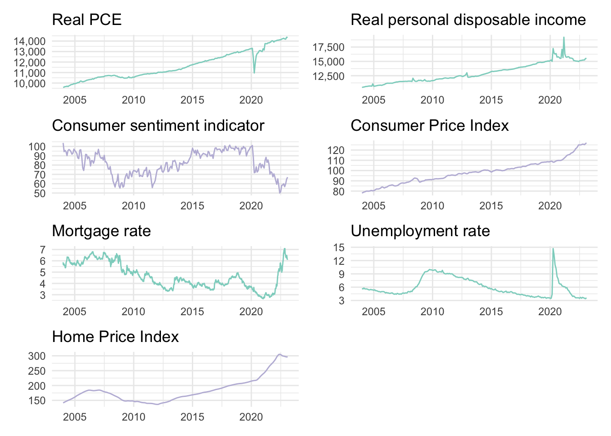
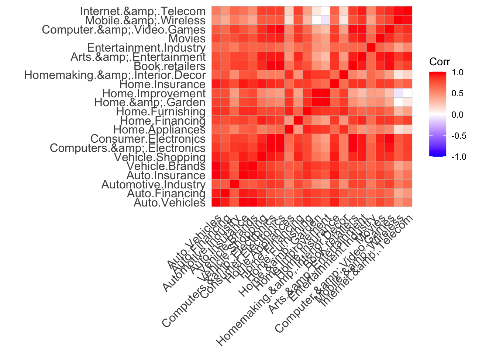
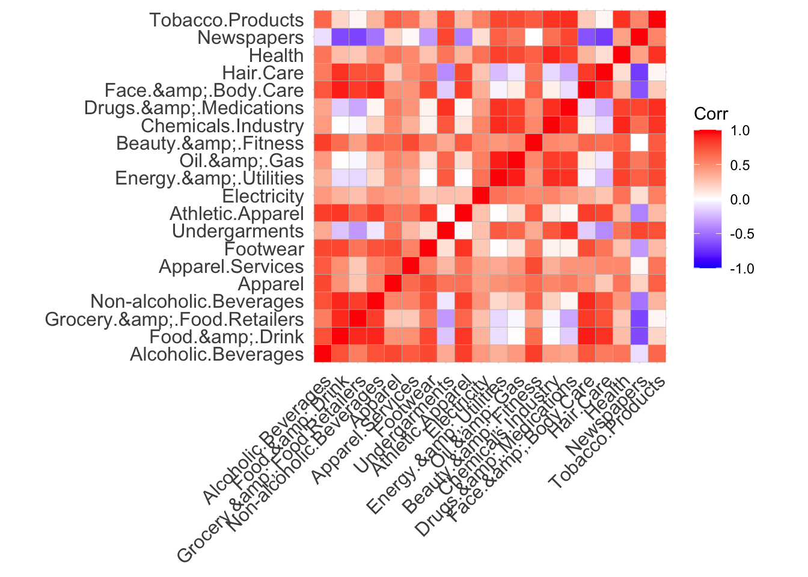
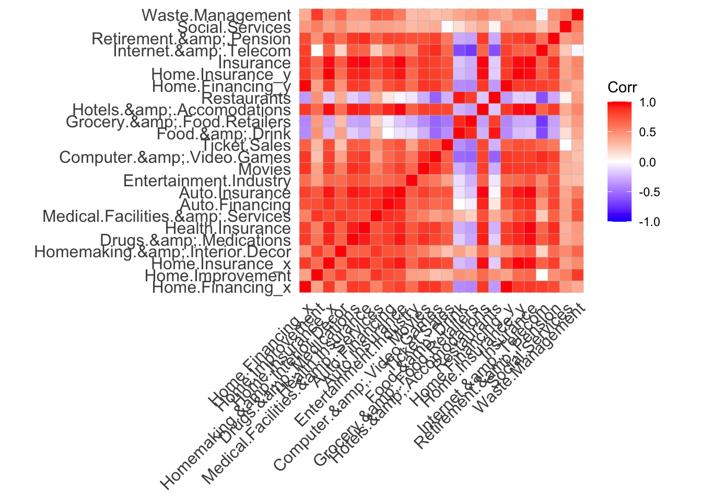
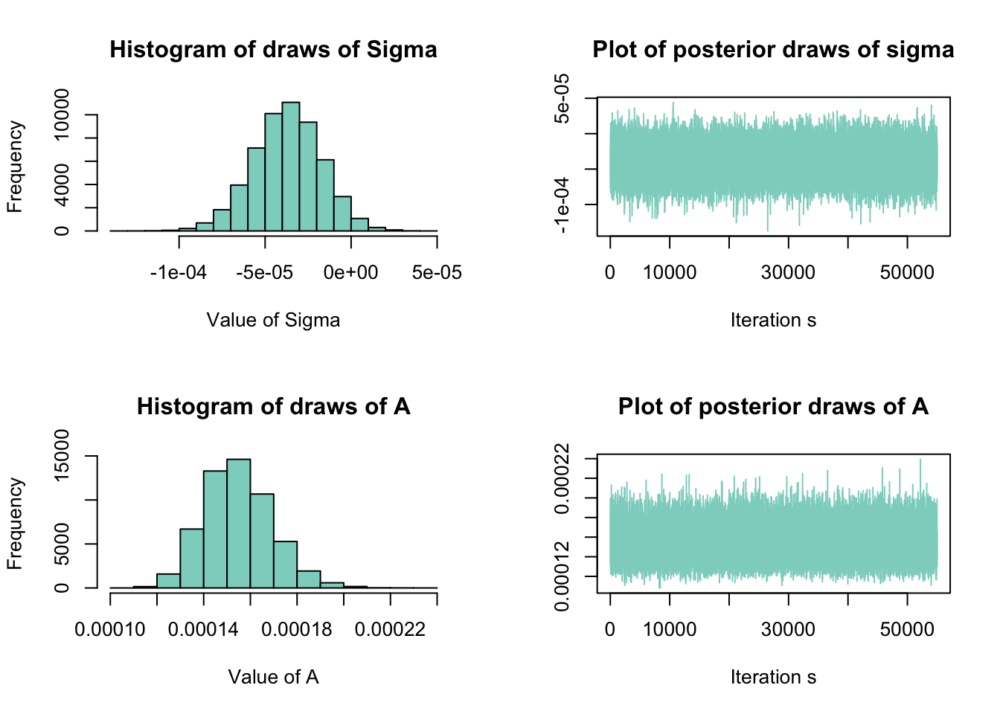
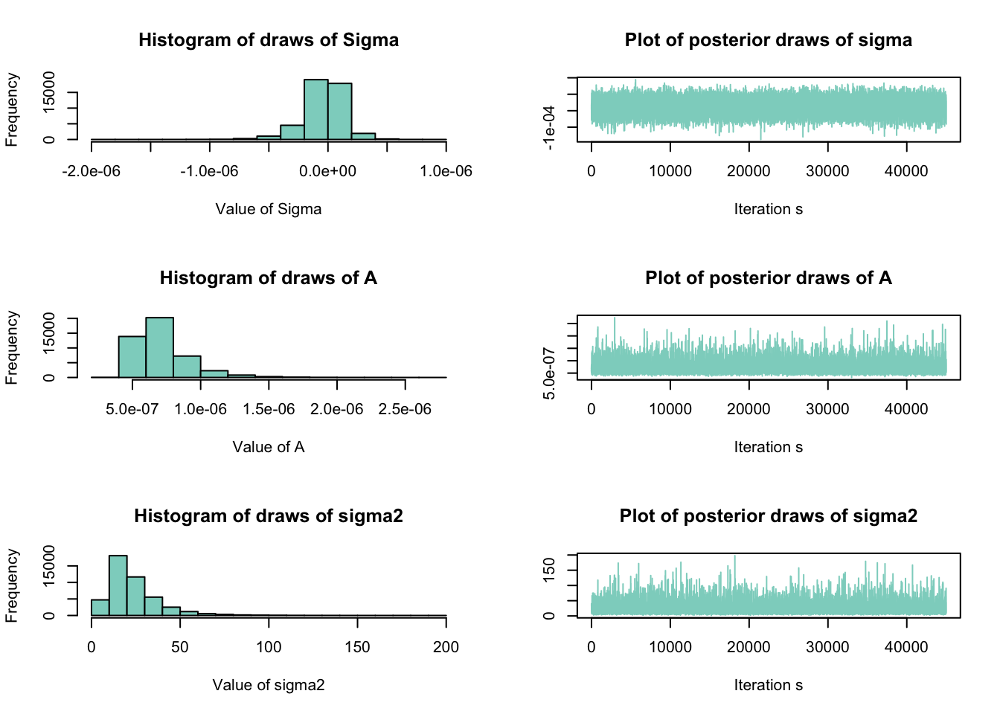
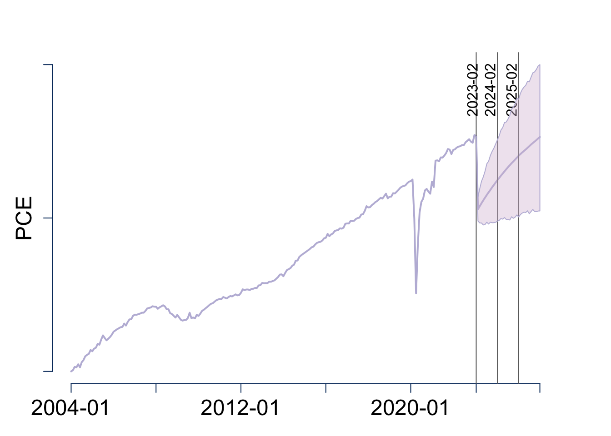
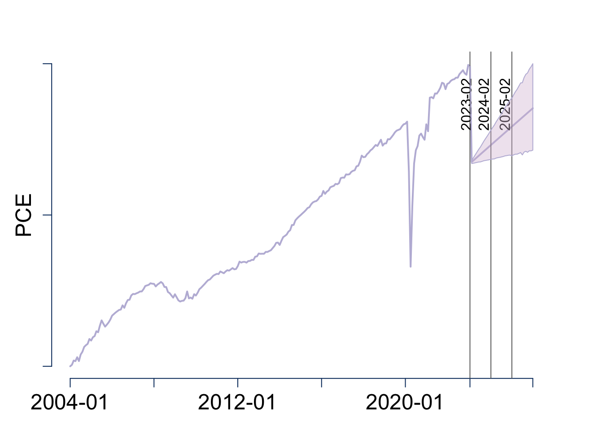

::: {.cell}
<style type="text/css">
.justify {
text-align: justify !important
}
</style>
:::


::: {.justify}
> **Abstract.** Can Bayesian VARs and alternative data help better estimate the future state of household final consumption expenditures in the US? As household consumption is a major component of GDP, this research project will study the potential use of Bayesian VARs with a mix of traditional economic data such as disposable income and an alternative data source which is Google Trends to forecast this indicator.

> **Keywords.** Bayesian Vars, Google Trends, new data types

# The question, objective and motivation

## Research question

Can Bayesian VARs and alternative data help better estimate the future state of Personal Consumption Expenditures in the US? 

## Objective and Motivation

As it drives around 50% of the US GDP, Personal Consumption Expenditures (PCE) is a leading indicator to gauge the economic health of a country. There is thus a high incentive to improve the accuracy of its predictions. This has encouraged researchers to investigate big data as alternative sources. For instance, Schimdt and Vosen (2009) use search query time-series provided by Google Trends to forecast consumption. Esteves (2009), Aprigliano, et al. (2019), Galbraith and Tkacz (2013), Carlsen and Storgaard (2010) analyze electronic payments to predict consumption as these can track a large percentage of spending activities. Ellingsen, et al. (2021) demonstrate that news media data capture information about consumption that hard economic indicators do not. Gil et al. (2018) investigate the potential of the Economic Policy Uncertainty index derived from news data and developed by Baker et al. (2016) to predict consumption.

According to Professor Tomasz Wozniak from the University of Melbourne, forecasting with Bayesian VARs often leads to more precise forecasts than when using the frequentist approach to forecasting because of the effect of the priors. Despite the benefits of Bayesian VARs, there is nearly no research on the combination of Bayesian VARs and alternative data. Existing articles either investigate the use of Bayesian estimation models or of alternative data to forecast indicators but do not consider both together.

This paper will compute and compare the forecasts of PCE in the US from Bayesian VARs and several extensions applied on traditional macroeconomic variables computed by statistical offices and alternative variables such as Google Trends. This research project contributes to the literature by studying PCE, an indicator that has to date received scant attention from the Bayesian VARs literature. Moreover, it proposes the first investigation of the combination of Bayesian VARs with alternative data to forecast PCE.

# The data and their properties

To forecast PCE, we will construct a dataset which contains two types of variables: traditional macroeconomic indicators and alternative variables.

### Traditional data

The traditional variables included in this analysis were collected from the fredr package and will be:

-   Real personal consumption expenditures

-   Real personal disposable income

-   Consumer Price Index 

-   Consumer Sentiment (University of Michigan)

-   30-Year Fixed Rate Mortgage

-   Unemployment rate

-   Home price index

Incorporating traditional economic variables along alternative data in this exercise is important as we do not want to fall in the "Big Data hubris" trap introduced by (Lazer et al., 2014). The "Big Data Hubris" is the problematic assumption that alternative data or big data can be used as a replacement for traditional data rather than a supplement. To prevent this, combining non-standard and standard variables together can lead to greater value. Moreover, previous extensive literature already has recognized the predictive power of these macroeconomic variables. For instance, previous research have identified co-movements of most common consumer sentiment indicators and real PCE (Schimdt and Vosen, 2009). 

##### Figure 1. Time series plots of the traditional variables {style="text-align: center;"}


::: {.cell}
::: {.cell-output-display}
{width=672}
:::
:::


### Alternative data

As for the alternative data, Google Trends variables will be included. Google Trends is a tool which reveals how frequently a certain keyword has been searched for on the Google web browser. The platform provides daily, weekly or monthly aggregated time series starting in 2004 for a specific keyword that can be directly downloaded on the Google Trends website. The Google Trends indices will be constructed based on the methodology presented in Schmidt and Vosen (2009) and Woo and Owen (2018). First, we downloaded the Google Trends (GT) time series from 2004-01 to 2023-02 of consumption relevant categories that represent the most the PCE product categories defined by the BEA's national income and product accounts. These categories were first identified by Schmidt and Vosen (2009) and later were adapted by Woo and Owen (2018) as some GT categories were removed or added since. In total, 72 series were collected at a monthly frequency. Second, we conducted a Principal Component Analysis (PCA) to reduce the dimensionality of this dataset. After this analysis, 4 alternative variables are added in our dataset to forecast PCE:

-   Transformed Google Trends series for PCE of durable goods

-   Transformed Google Trends series for PCE of non-durable goods (principal component 1)

-   Transformed Google Trends series for PCE of non-durable goods (principal component 2)

-   Transformed Google Trends series for PCE of services

## Preliminary data analysis

### Augmented Dickey-Fuller test for unit roots of traditional variables
##### Table 1. ADF results for traditional variables {style="text-align: center;"}

::: {.cell}
::: {.cell-output-display}
`````{=html}
<div data-pagedtable="false">
  <script data-pagedtable-source type="application/json">
{"columns":[{"label":["Variable"],"name":[1],"type":["chr"],"align":["left"]},{"label":["Statistic"],"name":[2],"type":["dbl"],"align":["right"]},{"label":["parameter"],"name":[3],"type":["dbl"],"align":["right"]},{"label":["alternative"],"name":[4],"type":["chr"],"align":["left"]},{"label":["p.value"],"name":[5],"type":["dbl"],"align":["right"]},{"label":["result"],"name":[6],"type":["chr"],"align":["left"]}],"data":[{"1":"PCE","2":"-1.703953","3":"6","4":"stationary","5":"0.7002929","6":"Non-stationary"},{"1":"Real disposable income","2":"-2.296847","3":"6","4":"stationary","5":"0.4512040","6":"Non-stationary"},{"1":"CPI","2":"1.097489","3":"6","4":"stationary","5":"0.9900000","6":"Non-stationary"},{"1":"Consumer Confidence Index","2":"-1.728860","3":"6","4":"stationary","5":"0.6898287","6":"Non-stationary"},{"1":"Mortgage rate","2":"-1.442994","3":"6","4":"stationary","5":"0.8099279","6":"Non-stationary"},{"1":"Unemployment rate","2":"-2.094054","3":"6","4":"stationary","5":"0.5364021","6":"Non-stationary"},{"1":"Home price index","2":"-1.175918","3":"6","4":"stationary","5":"0.9084588","6":"Non-stationary"}],"options":{"columns":{"min":{},"max":[10]},"rows":{"min":[10],"max":[10]},"pages":{}}}
  </script>
</div>
`````
:::
:::


##### Table 2. ADF results for first difference of traditional variables {style="text-align: center;"}

::: {.cell}
::: {.cell-output-display}
`````{=html}
<div data-pagedtable="false">
  <script data-pagedtable-source type="application/json">
{"columns":[{"label":["Variable"],"name":[1],"type":["chr"],"align":["left"]},{"label":["Statistic"],"name":[2],"type":["dbl"],"align":["right"]},{"label":["parameter"],"name":[3],"type":["dbl"],"align":["right"]},{"label":["alternative"],"name":[4],"type":["chr"],"align":["left"]},{"label":["p.value"],"name":[5],"type":["dbl"],"align":["right"]},{"label":["result"],"name":[6],"type":["chr"],"align":["left"]}],"data":[{"1":"PCE","2":"-7.210675","3":"6","4":"stationary","5":"0.0100000","6":"Stationary"},{"1":"Real disposable income","2":"-8.203181","3":"6","4":"stationary","5":"0.0100000","6":"Stationary"},{"1":"CPI","2":"-5.220949","3":"6","4":"stationary","5":"0.0100000","6":"Stationary"},{"1":"Consumer Confidence Index","2":"-6.660908","3":"6","4":"stationary","5":"0.0100000","6":"Stationary"},{"1":"Mortgage rate","2":"-4.775628","3":"6","4":"stationary","5":"0.0100000","6":"Stationary"},{"1":"Unemployment rate","2":"-6.783016","3":"6","4":"stationary","5":"0.0100000","6":"Stationary"},{"1":"Home price index","2":"-2.902058","3":"6","4":"stationary","5":"0.1969861","6":"Non-stationary"}],"options":{"columns":{"min":{},"max":[10]},"rows":{"min":[10],"max":[10]},"pages":{}}}
  </script>
</div>
`````
:::
:::

##### Table 3. ADF results for the second difference of Home price index {style="text-align: center;"}

::: {.cell}
::: {.cell-output-display}
`````{=html}
<div data-pagedtable="false">
  <script data-pagedtable-source type="application/json">
{"columns":[{"label":["Variable"],"name":[1],"type":["chr"],"align":["left"]},{"label":["Statistic"],"name":[2],"type":["dbl"],"align":["right"]},{"label":["parameter"],"name":[3],"type":["dbl"],"align":["right"]},{"label":["alternative"],"name":[4],"type":["chr"],"align":["left"]},{"label":["p.value"],"name":[5],"type":["dbl"],"align":["right"]},{"label":["result"],"name":[6],"type":["chr"],"align":["left"]}],"data":[{"1":"Home Price index","2":"-7.090738","3":"6","4":"stationary","5":"0.01","6":"Stationary"}],"options":{"columns":{"min":{},"max":[10]},"rows":{"min":[10],"max":[10]},"pages":{}}}
  </script>
</div>
`````
:::
:::

### Augmented Dickey-Fuller test for unit roots of alternative variables
##### Table 4. ADF results for the first difference of GT for PCE of durable goods

::: {.cell}
::: {.cell-output-display}
`````{=html}
<div data-pagedtable="false">
  <script data-pagedtable-source type="application/json">
{"columns":[{"label":["Variable"],"name":[1],"type":["chr"],"align":["left"]},{"label":["Statistic"],"name":[2],"type":["dbl"],"align":["right"]},{"label":["parameter"],"name":[3],"type":["dbl"],"align":["right"]},{"label":["alternative"],"name":[4],"type":["chr"],"align":["left"]},{"label":["p.value"],"name":[5],"type":["dbl"],"align":["right"]},{"label":["result"],"name":[6],"type":["chr"],"align":["left"]}],"data":[{"1":"Auto.Vehicles","2":"-8.684165","3":"6","4":"stationary","5":"0.01","6":"Stationary"},{"1":"Auto.Financing","2":"-7.055468","3":"6","4":"stationary","5":"0.01","6":"Stationary"},{"1":"Automotive.Industry","2":"-7.808498","3":"6","4":"stationary","5":"0.01","6":"Stationary"},{"1":"Auto.Insurance","2":"-6.820899","3":"6","4":"stationary","5":"0.01","6":"Stationary"},{"1":"Vehicle.Brands","2":"-8.145079","3":"6","4":"stationary","5":"0.01","6":"Stationary"},{"1":"Vehicle.Shopping","2":"-8.473722","3":"6","4":"stationary","5":"0.01","6":"Stationary"},{"1":"Computers.&amp;.Electronics","2":"-7.690294","3":"6","4":"stationary","5":"0.01","6":"Stationary"},{"1":"Consumer.Electronics","2":"-8.620902","3":"6","4":"stationary","5":"0.01","6":"Stationary"},{"1":"Home.Appliances","2":"-7.747484","3":"6","4":"stationary","5":"0.01","6":"Stationary"},{"1":"Home.Financing","2":"-6.404118","3":"6","4":"stationary","5":"0.01","6":"Stationary"},{"1":"Home.Furnishing","2":"-6.729985","3":"6","4":"stationary","5":"0.01","6":"Stationary"},{"1":"Home.&amp;.Garden","2":"-8.527617","3":"6","4":"stationary","5":"0.01","6":"Stationary"},{"1":"Home.Improvement","2":"-7.746263","3":"6","4":"stationary","5":"0.01","6":"Stationary"},{"1":"Home.Insurance","2":"-7.377421","3":"6","4":"stationary","5":"0.01","6":"Stationary"},{"1":"Homemaking.&amp;.Interior.Decor","2":"-7.666908","3":"6","4":"stationary","5":"0.01","6":"Stationary"},{"1":"Book.retailers","2":"-9.926044","3":"6","4":"stationary","5":"0.01","6":"Stationary"},{"1":"Arts.&amp;.Entertainment","2":"-7.647671","3":"6","4":"stationary","5":"0.01","6":"Stationary"},{"1":"Entertainment.Industry","2":"-8.428974","3":"6","4":"stationary","5":"0.01","6":"Stationary"},{"1":"Movies","2":"-6.814411","3":"6","4":"stationary","5":"0.01","6":"Stationary"},{"1":"Computer.&amp;.Video.Games","2":"-7.010014","3":"6","4":"stationary","5":"0.01","6":"Stationary"},{"1":"Mobile.&amp;.Wireless","2":"-7.236199","3":"6","4":"stationary","5":"0.01","6":"Stationary"},{"1":"Internet.&amp;.Telecom","2":"-6.813755","3":"6","4":"stationary","5":"0.01","6":"Stationary"}],"options":{"columns":{"min":{},"max":[10]},"rows":{"min":[10],"max":[10]},"pages":{}}}
  </script>
</div>
`````
:::
:::

##### Table 5. ADF results for the first difference of GT for PCE of non-durable goods

::: {.cell}
::: {.cell-output-display}
`````{=html}
<div data-pagedtable="false">
  <script data-pagedtable-source type="application/json">
{"columns":[{"label":["Variable"],"name":[1],"type":["chr"],"align":["left"]},{"label":["Statistic"],"name":[2],"type":["dbl"],"align":["right"]},{"label":["parameter"],"name":[3],"type":["dbl"],"align":["right"]},{"label":["alternative"],"name":[4],"type":["chr"],"align":["left"]},{"label":["p.value"],"name":[5],"type":["dbl"],"align":["right"]},{"label":["result"],"name":[6],"type":["chr"],"align":["left"]}],"data":[{"1":"Alcoholic.Beverages","2":"-7.375144","3":"6","4":"stationary","5":"0.01","6":"Stationary"},{"1":"Food.&amp;.Drink","2":"-6.684359","3":"6","4":"stationary","5":"0.01","6":"Stationary"},{"1":"Grocery.&amp;.Food.Retailers","2":"-7.625219","3":"6","4":"stationary","5":"0.01","6":"Stationary"},{"1":"Non-alcoholic.Beverages","2":"-6.121261","3":"6","4":"stationary","5":"0.01","6":"Stationary"},{"1":"Apparel","2":"-9.464528","3":"6","4":"stationary","5":"0.01","6":"Stationary"},{"1":"Apparel.Services","2":"-5.531368","3":"6","4":"stationary","5":"0.01","6":"Stationary"},{"1":"Footwear","2":"-10.152596","3":"6","4":"stationary","5":"0.01","6":"Stationary"},{"1":"Undergarments","2":"-8.372698","3":"6","4":"stationary","5":"0.01","6":"Stationary"},{"1":"Athletic.Apparel","2":"-8.444569","3":"6","4":"stationary","5":"0.01","6":"Stationary"},{"1":"Electricity","2":"-8.813848","3":"6","4":"stationary","5":"0.01","6":"Stationary"},{"1":"Energy.&amp;.Utilities","2":"-6.962458","3":"6","4":"stationary","5":"0.01","6":"Stationary"},{"1":"Oil.&amp;.Gas","2":"-7.480282","3":"6","4":"stationary","5":"0.01","6":"Stationary"},{"1":"Beauty.&amp;.Fitness","2":"-6.625331","3":"6","4":"stationary","5":"0.01","6":"Stationary"},{"1":"Chemicals.Industry","2":"-6.350327","3":"6","4":"stationary","5":"0.01","6":"Stationary"},{"1":"Drugs.&amp;.Medications","2":"-6.221827","3":"6","4":"stationary","5":"0.01","6":"Stationary"},{"1":"Face.&amp;.Body.Care","2":"-6.153962","3":"6","4":"stationary","5":"0.01","6":"Stationary"},{"1":"Hair.Care","2":"-7.774342","3":"6","4":"stationary","5":"0.01","6":"Stationary"},{"1":"Health","2":"-6.339824","3":"6","4":"stationary","5":"0.01","6":"Stationary"},{"1":"Newspapers","2":"-7.414035","3":"6","4":"stationary","5":"0.01","6":"Stationary"},{"1":"Tobacco.Products","2":"-6.792243","3":"6","4":"stationary","5":"0.01","6":"Stationary"}],"options":{"columns":{"min":{},"max":[10]},"rows":{"min":[10],"max":[10]},"pages":{}}}
  </script>
</div>
`````
:::
:::

##### Table 6. ADF results for the first difference of GT for PCE of services

::: {.cell}
::: {.cell-output-display}
`````{=html}
<div data-pagedtable="false">
  <script data-pagedtable-source type="application/json">
{"columns":[{"label":["Variable"],"name":[1],"type":["chr"],"align":["left"]},{"label":["Statistic"],"name":[2],"type":["dbl"],"align":["right"]},{"label":["parameter"],"name":[3],"type":["dbl"],"align":["right"]},{"label":["alternative"],"name":[4],"type":["chr"],"align":["left"]},{"label":["p.value"],"name":[5],"type":["dbl"],"align":["right"]},{"label":["result"],"name":[6],"type":["chr"],"align":["left"]}],"data":[{"1":"Home.Financing_x","2":"-6.404118","3":"6","4":"stationary","5":"0.01","6":"Stationary"},{"1":"Home.Improvement","2":"-7.746263","3":"6","4":"stationary","5":"0.01","6":"Stationary"},{"1":"Home.Insurance_x","2":"-7.377421","3":"6","4":"stationary","5":"0.01","6":"Stationary"},{"1":"Homemaking.&amp;.Interior.Decor","2":"-7.666908","3":"6","4":"stationary","5":"0.01","6":"Stationary"},{"1":"Drugs.&amp;.Medications","2":"-6.221827","3":"6","4":"stationary","5":"0.01","6":"Stationary"},{"1":"Health.Insurance","2":"-7.133697","3":"6","4":"stationary","5":"0.01","6":"Stationary"},{"1":"Medical.Facilities.&amp;.Services","2":"-6.387456","3":"6","4":"stationary","5":"0.01","6":"Stationary"},{"1":"Auto.Financing","2":"-7.055468","3":"6","4":"stationary","5":"0.01","6":"Stationary"},{"1":"Auto.Insurance","2":"-6.820899","3":"6","4":"stationary","5":"0.01","6":"Stationary"},{"1":"Entertainment.Industry","2":"-8.428974","3":"6","4":"stationary","5":"0.01","6":"Stationary"},{"1":"Movies","2":"-6.814411","3":"6","4":"stationary","5":"0.01","6":"Stationary"},{"1":"Computer.&amp;.Video.Games","2":"-7.010014","3":"6","4":"stationary","5":"0.01","6":"Stationary"},{"1":"Ticket.Sales","2":"-8.495668","3":"6","4":"stationary","5":"0.01","6":"Stationary"},{"1":"Food.&amp;.Drink","2":"-6.684359","3":"6","4":"stationary","5":"0.01","6":"Stationary"},{"1":"Grocery.&amp;.Food.Retailers","2":"-7.625219","3":"6","4":"stationary","5":"0.01","6":"Stationary"},{"1":"Hotels.&amp;.Accomodations","2":"-7.962005","3":"6","4":"stationary","5":"0.01","6":"Stationary"},{"1":"Restaurants","2":"-5.306536","3":"6","4":"stationary","5":"0.01","6":"Stationary"},{"1":"Home.Financing_y","2":"-6.404118","3":"6","4":"stationary","5":"0.01","6":"Stationary"},{"1":"Home.Insurance_y","2":"-7.377421","3":"6","4":"stationary","5":"0.01","6":"Stationary"},{"1":"Insurance","2":"-6.110919","3":"6","4":"stationary","5":"0.01","6":"Stationary"},{"1":"Internet.&amp;.Telecom","2":"-6.813755","3":"6","4":"stationary","5":"0.01","6":"Stationary"},{"1":"Retirement.&amp;.Pension","2":"-7.873718","3":"6","4":"stationary","5":"0.01","6":"Stationary"},{"1":"Social.Services","2":"-7.366660","3":"6","4":"stationary","5":"0.01","6":"Stationary"},{"1":"Waste.Management","2":"-8.376985","3":"6","4":"stationary","5":"0.01","6":"Stationary"}],"options":{"columns":{"min":{},"max":[10]},"rows":{"min":[10],"max":[10]},"pages":{}}}
  </script>
</div>
`````
:::
:::


### Principal Component Analysis on Google Trends data
Following the methodology in Schimdt and Vosen (2009), we will conduct a Principal Component Analysis on all Google Trends series to reduce the dimensionality of our dataset. The PCA is applied 3 times: one for the GT series related to PCE of durable goods, one for the GT series related to PCE of non-durable goods and one for the GT series related to PCE of services. We proceed as following: 

1. Normalising the data


::: {.cell}

:::


2. Computing the correlation matrices


::: {.cell}
::: {.cell-output-display}
{width=672}
:::

::: {.cell-output-display}
{width=672}
:::

::: {.cell-output-display}
{width=672}
:::
:::


The correlation matrices demonstrate strong relations between most of the variables. We therefore conclude that a PCA is appropriate.

3. Applying PCA on the correlation matrices

For PCE of durable goods, the summary table of PCA results show that the cumulative proportion of the first 2 components (Comp.1 and Comp.2) explain 88.05% of the total variance. The first component accounts for 72.32% of the variance and component 2 for only 15.73%. Therefore we make the choice to only use component 1.

##### Table 7. PCA results for GT for PCE of durable goods


::: {.cell}
::: {.cell-output .cell-output-stdout}
```
Importance of components:
                          PC1    PC2     PC3     PC4     PC5    PC6    PC7
Standard deviation     3.9887 1.8604 0.82472 0.74564 0.59551 0.4597 0.3840
Proportion of Variance 0.7232 0.1573 0.03092 0.02527 0.01612 0.0096 0.0067
Cumulative Proportion  0.7232 0.8805 0.91142 0.93669 0.95281 0.9624 0.9691
                           PC8     PC9    PC10    PC11    PC12    PC13    PC14
Standard deviation     0.37037 0.34255 0.30581 0.26989 0.22162 0.20700 0.18551
Proportion of Variance 0.00624 0.00533 0.00425 0.00331 0.00223 0.00195 0.00156
Cumulative Proportion  0.97535 0.98069 0.98494 0.98825 0.99048 0.99243 0.99399
                          PC15    PC16   PC17    PC18    PC19    PC20    PC21
Standard deviation     0.16288 0.14970 0.1324 0.12906 0.12358 0.11270 0.10567
Proportion of Variance 0.00121 0.00102 0.0008 0.00076 0.00069 0.00058 0.00051
Cumulative Proportion  0.99520 0.99622 0.9970 0.99777 0.99847 0.99904 0.99955
                          PC22
Standard deviation     0.09945
Proportion of Variance 0.00045
Cumulative Proportion  1.00000
```
:::
:::


For PCE of non-durable goods, we also take the first and second components as the first one only accounts for 47%. Together the two components explain 80.33% of the total variance.  

##### Table 8. PCA results for GT for PCE of non-durable goods


::: {.cell}
::: {.cell-output .cell-output-stdout}
```
Importance of components:
                          PC1    PC2     PC3     PC4     PC5     PC6     PC7
Standard deviation     3.0670 2.5806 1.10705 0.83951 0.70666 0.58067 0.48188
Proportion of Variance 0.4703 0.3330 0.06128 0.03524 0.02497 0.01686 0.01161
Cumulative Proportion  0.4703 0.8033 0.86457 0.89981 0.92478 0.94164 0.95325
                           PC8     PC9    PC10    PC11    PC12    PC13    PC14
Standard deviation     0.42032 0.37535 0.34214 0.32980 0.28856 0.26265 0.24208
Proportion of Variance 0.00883 0.00704 0.00585 0.00544 0.00416 0.00345 0.00293
Cumulative Proportion  0.96208 0.96912 0.97498 0.98042 0.98458 0.98803 0.99096
                          PC15   PC16    PC17    PC18    PC19    PC20
Standard deviation     0.21633 0.2100 0.17767 0.15568 0.13154 0.12975
Proportion of Variance 0.00234 0.0022 0.00158 0.00121 0.00087 0.00084
Cumulative Proportion  0.99330 0.9955 0.99708 0.99829 0.99916 1.00000
```
:::
:::

For PCE of services, we also take only the first component as it accounts for 62.5%.

##### Table 9. PCA results for GT for PCE of services


::: {.cell}
::: {.cell-output .cell-output-stdout}
```
Importance of components:
                         PC1    PC2     PC3     PC4     PC5    PC6     PC7
Standard deviation     3.873 2.2131 1.04542 0.89470 0.73197 0.5899 0.54149
Proportion of Variance 0.625 0.2041 0.04554 0.03335 0.02232 0.0145 0.01222
Cumulative Proportion  0.625 0.8290 0.87459 0.90795 0.93027 0.9448 0.95699
                           PC8     PC9    PC10    PC11   PC12    PC13   PC14
Standard deviation     0.44220 0.37394 0.35055 0.34079 0.3019 0.28800 0.2593
Proportion of Variance 0.00815 0.00583 0.00512 0.00484 0.0038 0.00346 0.0028
Cumulative Proportion  0.96514 0.97096 0.97608 0.98092 0.9847 0.98818 0.9910
                          PC15    PC16   PC17    PC18   PC19    PC20    PC21
Standard deviation     0.23067 0.20023 0.1900 0.17216 0.1389 0.12797 0.11670
Proportion of Variance 0.00222 0.00167 0.0015 0.00123 0.0008 0.00068 0.00057
Cumulative Proportion  0.99319 0.99486 0.9964 0.99760 0.9984 0.99909 0.99966
                          PC22     PC23      PC24
Standard deviation     0.09082 1.02e-15 5.678e-17
Proportion of Variance 0.00034 0.00e+00 0.000e+00
Cumulative Proportion  1.00000 1.00e+00 1.000e+00
```
:::
:::


After conducting the PCA analysis and keeping the first principal component which explains a considerable proportion of the variances, we obtain three transformed variables names GT_dur, GT_ndur and GT_sv.

# The Modelling Framework 

## The Baseline Model

The model used for the forecasting experiment is a VAR(p) model:


```{=tex}
\begin{aligned}
& y_t  =\mu_0+A_1 y_{t-1}+\cdots+A_p y_{t-p}+\epsilon_t \\ & \epsilon_t \mid  Y_{t-1}  \sim i i d \mathcal{N}_N\left(\mathbf{0}_N, \Sigma\right)
\end{aligned}
```


Where $N=11$ and $y_t$ is the vector of 11 variables:

The model can also be written in matrix notation:


```{=tex}
\begin{aligned}
Y & =X A+E \\E \mid X & \sim \mathcal{M N} _{T \times N}\left(\mathbf{0}_{T \times N}, \Sigma, I_T\right)
\end{aligned}
```


Where $Y$ is a $T\times11$ matrix, $X$ is a $T\times(1+(11\times p))$, $A$ is a $(1+(11\times p))\times 11$ matrix that contains the relationships between the variables and $E$ is a $T\times11$. $p$ is 4 and we have 230 observations of monthly data.

### The Likelihood function

$$
\begin{aligned}
Y \mid X,A,\Sigma & \sim \mathcal{M N} _{T \times N}\left(XA, \Sigma, I_T\right)
\end{aligned}
$$
$$
\begin{aligned}
L(A, \Sigma \mid Y, X) & \propto det(\Sigma)^{-\frac{T}{2}} \exp \left\{-\frac{1}{2} \operatorname{tr}\left[\Sigma^{-1}(Y-X A)^{\prime}(Y-X A)\right]\right\} \\
&= det (\Sigma)^{-\frac{T}{2}} \\
& \times \exp \left\{-\frac{1}{2} \operatorname{tr}\left[\Sigma^{-1}(A-\widehat{A})^{\prime} X^{\prime} X(A-\widehat{A})\right]\right\} \\
& \times \exp \left\{-\frac{1}{2} \operatorname{tr}\left[\Sigma^{-1}(Y-X \widehat{A})^{\prime}(Y-X \widehat{A})\right]\right\}
\end{aligned}
$$

### The prior distributions
$$
\begin{aligned}
&A \mid \Sigma \sim  \mathcal{M N} _{T \times N}(\underline{A}, \Sigma, \underline{V}) \\
&\Sigma \sim \mathcal{IW}_{N}(\underline{S}, \underline{\nu})
\end{aligned}
$$
$$
\begin{aligned}
p(A, \Sigma) \propto & \operatorname{det}(\Sigma)^{-\frac{N+K+\underline{\nu}+1}{2}} \\
& \times \exp \left\{-\frac{1}{2} \operatorname{tr}\left[\Sigma^{-1}(A-\underline{A})^{\prime} \underline{V}^{-1}(A-\underline{A})\right]\right\} \\
& \times \exp \left\{-\frac{1}{2} \operatorname{tr}\left[\Sigma^{-1} \underline{S}\right]\right\}
\end{aligned}
$$
As we follow the Minnesota prior specifications, we set in the code:

$$
\underline{A}=[0_{N\times 1}\space\space\space I_N \space\space\space 0_{N\times (p-1)N} ]'
\\ \underline{V}=diag([\kappa _2 \space\space\kappa_1(p^{-2}\otimes 1'_N)]
\\ \underline{\nu}=N+1
$$

### The posterior distribution
#### The Derivations of the posterior distribution

$$
\begin{aligned}
p(A,\Sigma \mid Y,X) \propto L(A, \Sigma \mid Y,X) p(A,\Sigma) = L(A, \Sigma \mid Y,X) p(A\mid\Sigma)p(\Sigma)
\end{aligned}
$$


Let's focus on the kernel
$$
\begin{aligned}
p(A, \Sigma \mid Y, X) \propto & \operatorname{det}(\Sigma)^{-\frac{T}{2}} \\
& \times \exp \left\{-\frac{1}{2} \operatorname{tr}\left[\Sigma^{-1}(A-\widehat{A})^{\prime} X^{\prime} X(A-\widehat{A})\right]\right\} \\
& \times \exp \left\{-\frac{1}{2} \operatorname{tr}\left[\Sigma^{-1}(Y-X \widehat{A})^{\prime}(Y-X \widehat{A})\right]\right\} \\
& \times \operatorname{det}(\Sigma)^{-\frac{N+K+\underline{+}+1}{2}} \\
& \times \exp \left\{-\frac{1}{2} \operatorname{tr}\left[\Sigma^{-1}(A-\underline{A})^{\prime} \underline{V}^{-1}(A-\underline{A})\right]\right\} \\
& \times \exp \left\{-\frac{1}{2} \operatorname{tr}\left[\Sigma^{-1} \underline{S}\right]\right\},
\end{aligned}
$$

$$
\begin{aligned}
& p(A, \Sigma \mid Y, X) \propto \operatorname{det}(\Sigma)^{-\frac{T+N+K+\underline{\nu}+1}{2}} \\
& \times \exp \left\{-\frac{1}{2} \operatorname{tr}\left[\Sigma ^ { - 1 } \left[(A-\widehat{A})^{\prime} X^{\prime} X(A-\widehat{A})+(A-\underline{A})^{\prime} \underline{V}^{-1}(A-\underline{A})\right.\right.\right. \\
& \left.\left.\left.+(Y-X \widehat{A})^{\prime}(Y-X \widehat{A})+\underline{S}\right]\right]\right\}
\end{aligned}
$$

We can now complete the squares.


```{=tex}
\begin{aligned}
& 
\color{blue}{(A-\widehat{A})^{\prime} X^{\prime} X(A-\widehat{A})}
\color{green}{
+(A-\underline{A})^{\prime} \underline{V}^{-1}(A-\underline{A})}
\color{red}{+(Y-X \widehat{A})^{\prime}(Y-X \widehat{A})}
\color{black}{+\underline{S}} \\

& \color{blue}{=A^\prime X^\prime XA -A^\prime X^\prime X \widehat{A} - \widehat{A}^\prime X^\prime XA + \widehat{A}^\prime X^\prime X \widehat{A}}
\color{green}{ +A^\prime \underline{V}^{-1}A - A^\prime \underline{V}^{-1} \underline{A} - \underline{A}^\prime \underline{V}^{-1} A + \underline{A}^\prime \underline{V}^{-1} \underline{A}}
\color{red}{+ Y^\prime Y-Y^\prime X \widehat{A} - \widehat{A}^\prime X^\prime Y + \widehat{A}^\prime X^\prime X \widehat{A}}
\color{black}{+ \underline{S}}\\
& \color{blue}{=A^\prime X^\prime XA -Y^\prime XA - \widehat{A}^\prime X^\prime XA}
\color{green}{ +A^\prime \underline{V}^{-1}A - A^\prime \underline{V}^{-1} \underline{A} - \underline{A}^\prime \underline{V}^{-1} A}
\color{red}{+ Y^\prime Y} 
\color{black}{+\underline{S}}
\color{green}{+ \underline{A}^\prime \underline{V}^{-1} \underline{A}}\\
& = A^\prime (X^\prime X+ \underline{V}^{-1})A -2A^\prime (X^\prime Y+\underline{V}^{-1} \underline{A}) + Y^\prime Y+ \underline{S} + \underline{A}^\prime \underline{V}^{-1} \underline{A}
\end{aligned}
```


We can set  $\overline{V}^{-1}=X^\prime X+ \underline{V}^{-1}$ 


$$
\begin{aligned}
& = A^\prime \overline{V}^{-1}A -2A^\prime \overline{V}^{-1}\overline{V} (X^\prime Y+\underline{V}^{-1} \underline{A}) + Y^\prime Y+ \underline{S} + \underline{A}^\prime \underline{V}^{-1} \underline{A}
\end{aligned}
$$

We can set $\overline{A}=\overline{V}(X^\prime Y+\underline{V}^{-1}\underline{A})$

$$
\begin{aligned}
& = A^\prime \overline{V}^{-1}A -2A^\prime \overline{V}^{-1}\overline{A} \pm \overline{A}^\prime \overline{V}^{-1}\overline{A} + Y^\prime Y+ \underline{S} + \underline{A}^\prime \underline{V}^{-1} \underline{A}\\
& =(A-\overline{A})^\prime \overline{V}^{-1}(A-\overline{A})-\overline{A}^\prime \overline{V}^{-1}\overline{A}+Y^\prime Y+\underline{S}+\underline{A}^\prime \underline{V}^{-1} \underline{A}
\end{aligned}
$$

Let's put the latter expression back in the $exp$.

$$
\begin{aligned}
\exp \left\{-\frac{1}{2} \operatorname{tr}\left[\Sigma^{-1}(A-\overline{A})^{\prime} \overline{V}^{-1}(A-\overline{A})\right]\right\}\exp \left\{-\frac{1}{2} \operatorname{tr}\left[\Sigma^{-1}\overline{S}\right]\right\}
\end{aligned}
$$

$$
\boxed{
\begin{array}{rcl}
&p(A,\Sigma \mid Y,X)= p(A \mid Y,X,\Sigma)p(\Sigma \mid Y,X) \\
&p(A \mid Y,X,\Sigma)=\mathcal{M N}_{K\times N}(\overline{A},\Sigma,\overline{V})\\
&p(\Sigma \mid Y,X)=\mathcal{I W}_N (\overline{S},\overline{\nu})\\
& \overline{V} = (X^\prime X + \underline{V}^{-1})^{-1}\\
& \overline{A}=\overline{V}(X^\prime Y+\underline{V}^{-1}\underline{A})\\
& \overline{\nu}=T+\underline{\nu}\\
& \overline{S}=\underline{S}+Y^\prime Y+\underline{A}^\prime \underline{V}^{-1}\underline{A}-\overline{A}^\prime \overline{V}^{-1}\overline{A}
\end{array}
}
$$

### The Code for Bayesian VAR estimation


::: {.cell}

```{.r .cell-code}
# Bayesian estimation of the baseline model

### Specify the setup
N       = ncol(df.log)
p       = 4
K       = 1+N*p
S       = c(5000,50000)
set.seed(123456)

### Create Y and X matrices
y       = ts(df.log, start=c(2004,1), frequency=12)
Y       = ts(y[5:nrow(y),], start=c(2004,2), frequency=12)
X       = matrix(1,nrow(Y),1)
for (i in 1:p){
  X     = cbind(X,y[5:nrow(y)-i,])
}

T       = nrow(Y)
## MLE
A.hat       = solve(t(X)%*%X)%*%t(X)%*%Y
Sigma.hat   = t(Y-X%*%A.hat)%*%(Y-X%*%A.hat)/T

## Specify the priors (Minnesota prior)
kappa.1           = 0.02^2
kappa.2           = 100
A.prior           = matrix(0,nrow(A.hat),ncol(A.hat))
A.prior[2:(N+1),] = diag(N)

priors = list(
  A.prior     = A.prior,
  V.prior     = diag(c(kappa.2,kappa.1*((1:p)^(-2))%x%rep(1,N))),
  S.prior     = diag(diag(Sigma.hat)),
  nu.prior    = N+1 
)

## BVAR function

BVAR = function(Y,X,priors,S){
  
  # normal-inverse Wishard posterior parameters
  V.bar.inv   = t(X)%*%X + diag(1/diag(priors$V.prior))
  V.bar       = solve(V.bar.inv)
  A.bar       = V.bar%*%(t(X)%*%Y + diag(1/diag(priors$V.prior))%*%priors$A.prior)
  nu.bar      = nrow(Y) + priors$nu.prior
  S.bar       = priors$S.prior + t(Y)%*%Y + t(priors$A.prior)%*%diag(1/diag(priors$V.prior))%*%priors$A.prior - t(A.bar)%*%V.bar.inv%*%A.bar
  S.bar.inv   = solve(S.bar)
  
  #posterior draws
  Sigma.posterior   = rWishart(sum(S), df=nu.bar, Sigma=S.bar.inv)
  Sigma.posterior   = apply(Sigma.posterior,3,solve)
  Sigma.posterior   = array(Sigma.posterior,c(N,N,sum(S)))
  A.posterior       = array(rnorm(prod(c(dim(A.bar),sum(S)))),c(dim(A.bar),sum(S)))
  L                 = t(chol(V.bar))
  
  for (s in 1:sum(S)){
    A.posterior[,,s]= A.bar + L%*%A.posterior[,,s]%*%chol(Sigma.posterior[,,s])
  }
  
  posterior = list(
    Sigma.posterior   = Sigma.posterior,
    A.posterior       = A.posterior
  )
  return(posterior)
}


## Apply function BVAR
posterior.draws = BVAR(Y=Y, X=X, priors=priors, S=S)
```
:::


The output of the BVAR function applied on the baseline model is: 

::: {.cell}

```{.r .cell-code}
round(apply(posterior.draws$A.posterior, 1:2, mean),3)
```

::: {.cell-output .cell-output-stdout}
```
        [,1]  [,2]  [,3]   [,4]   [,5]   [,6]  [,7]   [,8]   [,9]  [,10]  [,11]
 [1,] -0.001 0.004 0.002 -0.006  0.032  0.136 0.004  0.046 -0.008  0.048  0.062
 [2,]  1.000 0.000 0.000  0.000  0.000  0.000 0.000  0.000  0.000  0.000  0.000
 [3,]  0.000 1.000 0.000  0.000  0.000  0.000 0.000  0.000  0.000  0.000  0.000
 [4,]  0.000 0.000 1.000  0.000  0.000  0.000 0.000  0.000  0.000  0.000  0.000
 [5,]  0.000 0.000 0.000  1.000  0.000  0.000 0.000 -0.001 -0.001  0.000 -0.001
 [6,]  0.000 0.000 0.000  0.000  0.999  0.001 0.000 -0.001  0.001 -0.001 -0.003
 [7,]  0.000 0.000 0.000  0.001 -0.003  0.982 0.000  0.001  0.002  0.000  0.000
 [8,]  0.000 0.000 0.000  0.000  0.001  0.000 1.000  0.000  0.000  0.000  0.000
 [9,]  0.000 0.000 0.000  0.000  0.001  0.003 0.000  0.991 -0.010  0.008  0.000
[10,]  0.000 0.000 0.000  0.000 -0.001  0.008 0.000 -0.004  0.971  0.009  0.004
[11,]  0.000 0.000 0.000  0.000  0.000 -0.006 0.000  0.000  0.007  0.986 -0.009
[12,]  0.000 0.000 0.000  0.001  0.001 -0.002 0.000 -0.015 -0.008  0.000  0.980
[13,]  0.000 0.000 0.000  0.000  0.000  0.000 0.000  0.000  0.000  0.000  0.000
[14,]  0.000 0.000 0.000  0.000  0.000  0.000 0.000  0.000  0.000  0.000  0.000
[15,]  0.000 0.000 0.000  0.000  0.000  0.000 0.000  0.000  0.000  0.000  0.000
[16,]  0.000 0.000 0.000  0.000  0.000  0.000 0.000  0.000  0.000  0.000  0.000
[17,]  0.000 0.000 0.000  0.000 -0.001  0.001 0.000  0.000  0.001  0.000  0.000
[18,]  0.000 0.000 0.000  0.000 -0.001 -0.005 0.000  0.001  0.002 -0.001  0.000
[19,]  0.000 0.000 0.000  0.000  0.000  0.000 0.000  0.000  0.000  0.000  0.000
[20,]  0.000 0.000 0.000  0.000  0.000  0.000 0.000 -0.003 -0.001  0.000 -0.002
[21,]  0.000 0.000 0.000  0.000  0.000  0.002 0.000 -0.001  0.001  0.000 -0.001
[22,]  0.000 0.000 0.000  0.000  0.000 -0.001 0.000  0.002  0.002 -0.003  0.001
[23,]  0.000 0.000 0.000  0.000  0.000 -0.001 0.000 -0.003  0.000 -0.001 -0.003
[24,]  0.000 0.000 0.000  0.000  0.000  0.000 0.000  0.000  0.000  0.000  0.000
[25,]  0.000 0.000 0.000  0.000  0.000  0.000 0.000  0.000  0.000  0.000  0.000
[26,]  0.000 0.000 0.000  0.000  0.000  0.000 0.000  0.000  0.000  0.000  0.000
[27,]  0.000 0.000 0.000  0.000  0.000  0.000 0.000  0.000  0.000  0.000  0.000
[28,]  0.000 0.000 0.000  0.000  0.000  0.000 0.000  0.000  0.000  0.000  0.000
[29,]  0.000 0.000 0.000  0.000  0.000 -0.002 0.000  0.001  0.001  0.000  0.000
[30,]  0.000 0.000 0.000  0.000  0.000  0.000 0.000  0.000  0.000  0.000  0.000
[31,]  0.000 0.000 0.000  0.000  0.000  0.000 0.000  0.000  0.000 -0.001 -0.001
[32,]  0.000 0.000 0.000  0.000 -0.001  0.001 0.000  0.000  0.000 -0.001  0.000
[33,]  0.000 0.000 0.000  0.000  0.000  0.000 0.000  0.001  0.000  0.000  0.002
[34,]  0.000 0.000 0.000  0.000  0.000  0.000 0.000  0.001 -0.001 -0.001  0.000
[35,]  0.000 0.000 0.000  0.000  0.000  0.000 0.000  0.000  0.000  0.000  0.000
[36,]  0.000 0.000 0.000  0.000  0.000  0.000 0.000  0.000  0.000  0.000  0.000
[37,]  0.000 0.000 0.000  0.000  0.000  0.000 0.000  0.000  0.000  0.000  0.000
[38,]  0.000 0.000 0.000  0.000  0.000  0.000 0.000  0.000  0.000  0.000  0.000
[39,]  0.000 0.000 0.000  0.000  0.000  0.000 0.000  0.000  0.000  0.000  0.000
[40,]  0.000 0.000 0.000  0.000  0.000 -0.001 0.000  0.001  0.001  0.000  0.001
[41,]  0.000 0.000 0.000  0.000  0.000  0.000 0.000  0.000  0.000  0.000  0.000
[42,]  0.000 0.000 0.000  0.000  0.000  0.000 0.000  0.001  0.000 -0.001  0.000
[43,]  0.000 0.000 0.000  0.000  0.000  0.000 0.000  0.001  0.001 -0.001  0.000
[44,]  0.000 0.000 0.000  0.000  0.000  0.000 0.000  0.000 -0.001  0.000  0.001
[45,]  0.000 0.000 0.000  0.000  0.000  0.000 0.000  0.001  0.000 -0.001  0.000
```
:::
:::

::: {.cell}

```{.r .cell-code}
round(apply(posterior.draws$Sigma.posterior, 1:2, mean),3)
```

::: {.cell-output .cell-output-stdout}
```
        [,1]   [,2]   [,3]   [,4]   [,5]   [,6]   [,7]   [,8]   [,9]  [,10]
 [1,]  0.000  0.000  0.000  0.000  0.000 -0.007  0.000  0.000  0.001  0.000
 [2,]  0.000  0.001  0.000  0.000  0.000  0.007  0.000 -0.001  0.000  0.001
 [3,]  0.000  0.000  0.000  0.000  0.000 -0.001  0.000  0.000  0.001 -0.001
 [4,]  0.000  0.000  0.000  0.003  0.000 -0.012  0.000 -0.004  0.001  0.002
 [5,]  0.000  0.000  0.000  0.000  0.045  0.000  0.000 -0.007  0.005  0.012
 [6,] -0.007  0.007 -0.001 -0.012  0.000  0.548 -0.001 -0.028 -0.032  0.024
 [7,]  0.000  0.000  0.000  0.000  0.000 -0.001  0.000  0.000  0.000  0.000
 [8,]  0.000 -0.001  0.000 -0.004 -0.007 -0.028  0.000  0.523  0.444 -0.084
 [9,]  0.001  0.000  0.001  0.001  0.005 -0.032  0.000  0.444  1.201 -0.308
[10,]  0.000  0.001 -0.001  0.002  0.012  0.024  0.000 -0.084 -0.308  0.332
[11,] -0.001  0.000  0.000 -0.006 -0.004  0.023  0.000  0.473  0.256  0.134
       [,11]
 [1,] -0.001
 [2,]  0.000
 [3,]  0.000
 [4,] -0.006
 [5,] -0.004
 [6,]  0.023
 [7,]  0.000
 [8,]  0.473
 [9,]  0.256
[10,]  0.134
[11,]  0.751
```
:::
:::

::: {.cell}
::: {.cell-output-display}
{width=672}
:::
:::

## The extended model
### The prior distribution
$$
\begin{array}{rcl}
&A \mid \Sigma,{\color{red}\kappa} \sim  \mathcal{M N} _{T \times N}(\underline{A}, \Sigma, {\color{red}\kappa}\underline{V}) \\
&\color{red}{\kappa \sim \mathcal{IG2}(\underline{s}_\kappa,\underline{\nu}_\kappa)}\\
&\Sigma \sim \mathcal{IW}_{N}(\underline{S}, \underline{\nu})
\end{array}
$$

### The posterior distribution
In this section, we will derive the the joint full-conditional posterior distribution of $A$ and $\Sigma$ and the full-conditional posterior distribution of $\kappa$.

#### The Derivations of the joint full-conditional posterior distribution of A and Sigma
$$
\begin{aligned}
p(A,\Sigma \mid Y,X,{\color{red}\kappa}) \propto L(A, \Sigma \mid Y,X) p(A,\Sigma) = L(A, \Sigma \mid Y,X) p(A\mid\Sigma,{\color{red}\kappa})p(\Sigma)p({\color{red}\kappa})
\end{aligned} 4
$$
Let's focus on the kernel


```{=tex}
\begin{aligned}
p(A,\Sigma \mid Y,X,{\color{red}{\kappa}}) \propto & det (\Sigma)^{-\frac{T}{2}} \\
& \times \exp \left\{-\frac{1}{2} \operatorname{tr}\left[\Sigma^{-1}(A-\widehat{A})^{\prime} X^{\prime} X(A-\widehat{A})\right]\right\} \\
& \times \exp \left\{-\frac{1}{2} \operatorname{tr}\left[\Sigma^{-1}(Y-X \widehat{A})^{\prime}(Y-X \widehat{A})\right]\right\} \\
& \times det(\Sigma)^{-\frac{N+K+\underline{\nu}+1}{2}} \\
& \times \exp \left\{-\frac{1}{2} \operatorname{tr}\left[\Sigma^{-1}(A-\underline{A})^{\prime} \underline{V}^{-1}(A-\underline{A})\right]\right\} \\
& \times \exp \left\{-\frac{1}{2} \operatorname{tr}\left[\Sigma^{-1} \underline{S}\right]\right\}\\

& = \operatorname{det}(\Sigma)^{-\frac{T+N+K+\underline{\nu}+1}{2}} \\
& \times \exp \{-\frac{1}{2} \operatorname{tr}[\Sigma^{-1} [(A-\widehat{A})^{\prime} X^{\prime} X(A-\widehat{A})+(A-\underline{A})^{\prime} \frac{1}{\kappa} \underline{V}^{-1}(A-\underline{A}) \\
& +(Y-X \widehat{A})^{\prime}(Y-X \widehat{A})+\underline{S}]]\}

\end{aligned}
```

```{=tex}
\begin{aligned}
& 
(A-\widehat{A})^{\prime} X^{\prime} X(A-\widehat{A})
+(A-\underline{A})^{\prime} {\color{red}{\frac{1}{\kappa}}}\underline{V}^{-1}(A-\underline{A})
+(Y-X \widehat{A})^{\prime}(Y-X \widehat{A})
+\underline{S} \\

& =A^\prime X^\prime XA -A^\prime X^\prime X \widehat{A} - \widehat{A}^\prime X^\prime XA + \widehat{A}^\prime X^\prime X \widehat{A}
 +A^\prime {\color{red}{\frac{1}{\kappa}}}\underline{V}^{-1}A - A^\prime {\color{red}{\frac{1}{\kappa}}}\underline{V}^{-1} \underline{A} - \underline{A}^\prime {\color{red}{\frac{1}{\kappa}}}\underline{V}^{-1} A + \underline{A}^\prime {\color{red}{\frac{1}{\kappa}}}\underline{V}^{-1} \underline{A}
+ Y^\prime Y-Y^\prime X \widehat{A} - \widehat{A}^\prime X^\prime Y + \widehat{A}^\prime X^\prime X \widehat{A}+ \underline{S}\\

& =A^\prime X^\prime XA -Y^\prime XA - \widehat{A}^\prime X^\prime XA
 +A^\prime {\color{red}{\frac{1}{\kappa}}}\underline{V}^{-1}A - A^\prime {\color{red}{\frac{1}{\kappa}}}\underline{V}^{-1} \underline{A} - \underline{A}^\prime {\color{red}{\frac{1}{\kappa}}}\underline{V}^{-1} A
+ Y^\prime Y+ \underline{S} + \underline{A}^\prime {\color{red}{\frac{1}{\kappa}}}\underline{V}^{-1} \underline{A}\\
& = A^\prime (X^\prime X+ {\color{red}{\frac{1}{\kappa}}}\underline{V}^{-1})A -2A^\prime (X^\prime Y+{\color{red}{\frac{1}{\kappa}}}\underline{V}^{-1} \underline{A}) + Y^\prime Y+ \underline{S} + \underline{A}^\prime {\color{red}{\frac{1}{\kappa}}}\underline{V}^{-1} \underline{A}
\end{aligned}
```

```{=tex}
\begin{aligned}
\boxed{
\begin{array}{rcl}
&p(A,\Sigma \mid Y,X,{\color{red}\kappa})= \mathcal{MNIW}_{K\times N}(\overline{A},\overline{V},\overline{S},\overline{\nu}) \\
& \overline{V} = (X^\prime X + {\color{red}{\frac{1}{\kappa}}}\underline{V}^{-1})^{-1}\\
& \overline{A}=\overline{V}(X^\prime Y+{\color{red}{\frac{1}{\kappa}}}\underline{V}^{-1}\underline{A})\\
& \overline{\nu}=T+\underline{\nu}\\
& \overline{S}=\underline{S}+Y^\prime Y+\underline{A}^\prime \underline{V}^{-1}{\color{red}{\frac{1}{\kappa}}}\underline{A}-\overline{A}^\prime \overline{V}^{-1}\overline{A}
\end{array}
}
\end{aligned}
```


#### The Derivations of the full-conditional posterior distribution of $\kappa$


```{=tex}
\begin{align}
p(\kappa \mid A, \Sigma, Y,X) & =L(A,\Sigma \mid Y,X)p(\kappa \mid \underline{s}_{\kappa}, \underline{\nu}_{\kappa})p(A,\Sigma)\\
& =L(A,\Sigma \mid Y,X)p(\kappa \mid \underline{s}_{\kappa}, \underline{\nu}_{\kappa})p(A\mid \Sigma)p(\Sigma)\\

&= (\kappa)^{-\frac{\underline{\nu}+2}{2}}\exp\left\{\frac{-1}{2}\frac{\underline{s}_{\kappa}}{\kappa}\right\} \\
& \times det(\kappa \underline{V})^{-\frac{N}{2}}
\exp\left\{-\frac{1}{2} \operatorname{tr}\left[\Sigma^{-1}(A-\underline{A})^{\prime} \frac{1}{\kappa}\underline{V}^{-1}(A-\underline{A})\right]\right\} \\

&= (\kappa)^{-\frac{\underline{\nu}+2}{2}}(\kappa)^{-\frac{KN}{2}}\kappa ^{-\frac{\underline{\nu}+KN+2}{2}}\times \exp\left\{\frac{-1}{2} \frac{1}{\kappa}(\underline{s}_{\kappa}+\operatorname{tr}\left[\Sigma^{-1}(A-\underline{A})^{\prime} \underline{V}^{-1}(A-\underline{A})\right])\overline{s}_{\kappa}\right\}\\

&= \kappa ^{-\frac{\overbrace{\underline{\nu}+KN}^{\overline{\nu}_{\kappa}}+2}{2}}\times \exp\left\{\frac{-1}{2} \frac{1}{\kappa}\underbrace{(\underline{s}_{\kappa}+\operatorname{tr}\left[\Sigma^{-1}(A-\underline{A})^{\prime} \underline{V}^{-1}(A-\underline{A})\right])}_{\overline{s}_{\kappa}}\right\}

\end{align}
```


We obtain the following full-conditional posterior distribution of $\kappa$:

$$
\boxed{
\begin{array}{rcl}
&\kappa \sim \mathcal{IG2}(\overline{s}_{\kappa},\overline{\nu}_{\kappa})\\
& \overline{s}_{\kappa}=\underline{s}_{\kappa}+\operatorname{tr}\left[\Sigma^{-1}(A-\underline{A})^{\prime} \underline{V}^{-1}(A-\underline{A})\right]\\
&\overline{\nu}_{\kappa}=\underline{\nu}+KN
\end{array}
}
$$

### The Code for Bayesian VAR estimation
Let's adapt the BVAR function to the extended model. 


::: {.cell}

```{.r .cell-code}
####Extended model

### Modify the priors
S       = c(5000,50000)
kappa.1           = 1
kappa.2           = 10
initial_kappa     = 100
A.prior           = matrix(0,nrow(A.hat),ncol(A.hat))
A.prior[2:(N+1),] = diag(N)

priors = list(
  A.prior            = A.prior,
  V.prior            = diag(c(kappa.2,kappa.1*((1:p)^(-2))%x%rep(1,N))),
  S.prior            = diag(diag(Sigma.hat)),
  nu.prior           = N+1,
  s.kappa.prior      = 2,
  nu.kappa.prior     = 4
)

### Modify BVAR function

BVAR_extension = function(X,Y,priors,initial_kappa,S){
  
  A.posterior        = array(NA, dim = c(K,N,sum(S)))
  Sigma.posterior    = array(NA,dim=c(N,N,sum(S)))
  kappa.posterior    = matrix(NA, sum(S), 1) 
  kappa.posterior[1] = initial_kappa
  
  for (s in 1:sum(S)){
    # full-cond of joint posterior of A and Sigma
    V.bar.inv   = t(X)%*%X + diag(1/diag(kappa.posterior[s]*priors$V.prior))
    V.bar       = solve(V.bar.inv)
    A.bar       = V.bar%*%(t(X)%*%Y + diag(1/diag(kappa.posterior[s]*priors$V.prior))%*%priors$A.prior)
    nu.bar      = nrow(Y) + priors$nu.prior
    S.bar       = priors$S.prior + t(Y)%*%Y + t(priors$A.prior)%*%diag(1/diag(kappa.posterior[s]*priors$V.prior))%*%priors$A.prior - t(A.bar)%*%V.bar.inv%*%A.bar
    S.bar.inv   = solve(S.bar)
    
    
    Sigma.posterior.dist   = rWishart(1, df=nu.bar, Sigma=S.bar.inv)
    Sigma.draw             = apply(Sigma.posterior.dist,3,solve)
    Sigma.posterior[,,s]   = Sigma.draw
    A.posterior[,,s]            = array(rnorm(prod(c(dim(A.bar),1))),c(dim(A.bar),1))
    L                      = t(chol(V.bar))
    A.posterior[,,s]       = A.bar + L%*%A.posterior[,,s]%*%chol(Sigma.posterior[,,s])
    
    #full conditional posterior of kappa
    if (s!=sum(S)){
      s.kappa.bar           = priors$s.kappa.prior + sum(diag(solve( Sigma.posterior[,,s])*t(A.posterior[,,s]-priors$A.prior)%*%diag(1/diag(priors$V.prior))%*%(A.posterior[,,s]-priors$A.prior)))
      nu.kappa.bar          = priors$nu.kappa.prior + (K*N)
      kappa.draw            = s.kappa.bar/rchisq(1, df=nu.kappa.bar)
      kappa.posterior[s+1]  = kappa.draw
    }
  }
  
  posterior.extension = list(
    Sigma.posterior   = Sigma.posterior[,,S[1]+1:S[2]], #getting rid of first S[1] draws
    A.posterior       = A.posterior[,,S[1]+1:S[2]],
    kappa.posterior   = kappa.posterior[S[1]+1:S[2],1]
  )
  return(posterior.extension)
}

## Apply function BVAR_extension
posterior.ext.draws = BVAR_extension(Y=Y, X=X, priors=priors, initial_kappa=initial_kappa, S=S)
```
:::


The output of the BVAR function applied on the baseline model is: 

::: {.cell}

```{.r .cell-code}
round(apply(posterior.ext.draws$Sigma.posterior, 1:2, mean),3)
```

::: {.cell-output .cell-output-stdout}
```
        [,1]   [,2] [,3]   [,4]   [,5]   [,6] [,7]   [,8]   [,9]  [,10]  [,11]
 [1,]  0.000  0.000    0  0.000  0.000 -0.004    0  0.000  0.000  0.000  0.000
 [2,]  0.000  0.000    0  0.000  0.000  0.002    0 -0.001 -0.001  0.000  0.000
 [3,]  0.000  0.000    0  0.000  0.000  0.000    0  0.000  0.000  0.000  0.000
 [4,]  0.000  0.000    0  0.002  0.001 -0.006    0  0.001  0.001  0.001  0.001
 [5,]  0.000  0.000    0  0.001  0.030  0.001    0 -0.004  0.010 -0.001 -0.005
 [6,] -0.004  0.002    0 -0.006  0.001  0.283    0 -0.021  0.021 -0.018 -0.017
 [7,]  0.000  0.000    0  0.000  0.000  0.000    0  0.000  0.000  0.000  0.000
 [8,]  0.000 -0.001    0  0.001 -0.004 -0.021    0  0.337  0.347 -0.026  0.307
 [9,]  0.000 -0.001    0  0.001  0.010  0.021    0  0.347  0.746 -0.119  0.272
[10,]  0.000  0.000    0  0.001 -0.001 -0.018    0 -0.026 -0.119  0.115  0.018
[11,]  0.000  0.000    0  0.001 -0.005 -0.017    0  0.307  0.272  0.018  0.392
```
:::

```{.r .cell-code}
round(apply(posterior.ext.draws$A.posterior, 1:2, mean),3)
```

::: {.cell-output .cell-output-stdout}
```
        [,1]   [,2]   [,3]   [,4]   [,5]    [,6]   [,7]    [,8]    [,9]   [,10]
 [1,]  0.946  1.551  0.039  3.598 15.017 -15.672  0.034 -15.442 107.938 -27.315
 [2,]  1.613 -1.327  0.101  1.351  1.876 -67.556  0.064   4.435  -7.041   2.583
 [3,] -0.102  0.388 -0.005 -0.218 -0.823   7.196 -0.024  -0.677   4.947  -3.017
 [4,]  0.129 -0.011  1.235 -0.788  7.931  -8.448  0.043   7.413  11.516 -13.749
 [5,]  0.020  0.031  0.002  0.896  0.524  -0.857  0.013   0.946   0.282  -0.566
 [6,]  0.002 -0.006  0.000 -0.006  0.917  -0.170 -0.002  -0.338  -0.539   0.096
 [7,]  0.016 -0.017  0.002  0.016  0.045  -0.132  0.001  -0.023  -0.271   0.108
 [8,]  0.077 -0.363  0.038  0.802 -4.423  -5.451  1.348   0.349   3.844  -6.482
 [9,]  0.002 -0.008 -0.001 -0.012 -0.006  -0.100  0.000   0.922   0.720   0.243
[10,] -0.002 -0.002  0.000 -0.001 -0.016   0.082  0.000   0.025   0.467  -0.058
[11,]  0.000 -0.006  0.000  0.010 -0.069  -0.122  0.000   0.063   0.162   0.523
[12,]  0.001  0.007  0.000  0.020  0.041  -0.050  0.001  -0.192  -0.319  -0.169
[13,] -0.598  0.495 -0.034 -1.087 -0.844  48.839 -0.029  -5.283 -14.891   1.176
[14,]  0.065  0.470  0.008  0.391 -0.699  -0.209 -0.001  -2.776  -1.139  -0.051
[15,] -0.034  0.140 -0.190  0.530 -3.807   3.469 -0.018   2.740   0.717   2.650
[16,] -0.035  0.012 -0.007 -0.236 -0.025   1.585  0.003  -0.139  -0.542   1.218
[17,]  0.002 -0.005  0.000  0.015 -0.171  -0.193  0.000   0.252   0.471  -0.100
[18,] -0.013  0.009 -0.001 -0.019 -0.008   0.943 -0.001   0.036  -0.064  -0.016
[19,] -0.039  0.159 -0.007 -0.667  0.420   2.618 -0.189  -2.702  -9.125   4.096
[20,] -0.004  0.002  0.000  0.017 -0.020   0.240 -0.001  -0.329  -0.799   0.318
[21,]  0.001  0.001  0.001 -0.012  0.031  -0.033  0.000   0.178   0.487  -0.178
[22,]  0.002  0.002  0.002 -0.019  0.001   0.005 -0.001   0.144   0.328  -0.438
[23,]  0.003  0.001 -0.001  0.002  0.005  -0.162  0.000  -0.024   0.317  -0.039
[24,] -0.105  0.247 -0.019  0.311  1.001  10.886 -0.029  -0.620   2.298  -2.118
[25,]  0.047  0.042 -0.001  0.231 -0.713  -0.412  0.018  -0.387   0.736   4.845
[26,] -0.009  0.060 -0.070 -0.368 -2.163   1.703 -0.003   2.621  -4.593   3.641
[27,]  0.037  0.013 -0.005  0.138 -0.192  -1.382 -0.002  -0.730  -2.409  -0.227
[28,] -0.004  0.008 -0.001  0.013  0.102   0.512  0.000  -0.189  -0.149   0.025
[29,] -0.003  0.010 -0.001 -0.006 -0.006   0.217 -0.001  -0.132  -0.033  -0.067
[30,]  0.010  0.159 -0.007 -0.275  2.779   0.977 -0.110  -3.167  -0.914   2.327
[31,]  0.001 -0.001  0.001 -0.006 -0.005  -0.043  0.000  -0.113   0.805  -0.269
[32,] -0.002  0.002  0.000  0.000 -0.035   0.076  0.000   0.116  -0.107  -0.001
[33,] -0.001  0.006  0.000  0.014 -0.053  -0.122  0.000   0.224   0.394  -0.047
[34,]  0.002  0.000 -0.001  0.001  0.036  -0.031  0.000  -0.022  -0.713   0.348
[35,] -0.035  0.346  0.006 -0.676 -1.379   6.096 -0.024  -0.475   2.635   0.966
[36,] -0.033 -0.008 -0.035 -0.235 -1.256  -1.796 -0.007  -0.477  -2.999   0.547
[37,] -0.050  0.062 -0.035 -0.151 -0.777   2.292  0.020   4.259  -1.475   3.311
[38,] -0.007  0.000  0.004  0.033 -0.068  -0.154 -0.005   1.026   2.265  -0.568
[39,]  0.002 -0.001  0.001 -0.009 -0.085  -0.260 -0.001   0.139   0.142  -0.127
[40,]  0.002 -0.002  0.000  0.003 -0.021  -0.176  0.000   0.125   0.279   0.001
[41,] -0.012  0.109 -0.012  0.144  2.474   1.153 -0.040   4.033   8.282   0.263
[42,] -0.001 -0.009 -0.002 -0.004  0.001   0.084  0.000  -0.036  -0.465   0.344
[43,]  0.002  0.001  0.000 -0.001 -0.015  -0.097  0.000   0.083   0.076   0.029
[44,]  0.001  0.001 -0.002 -0.001  0.025   0.103  0.000   0.011  -0.736   0.469
[45,] -0.001  0.005  0.002  0.004 -0.002   0.051  0.000   0.107   0.477  -0.480
        [,11]
 [1,] -38.451
 [2,]   2.883
 [3,]  -2.903
 [4,]  -5.569
 [5,]  -0.023
 [6,]  -0.242
 [7,]   0.030
 [8,]  -1.159
 [9,]   0.603
[10,]   0.024
[11,]   0.006
[12,]   0.045
[13,]  -1.662
[14,]  -2.423
[15,]  10.543
[16,]   1.665
[17,]   0.023
[18,]   0.024
[19,]  -4.030
[20,]  -0.186
[21,]   0.036
[22,]  -0.219
[23,]   0.070
[24,]  -2.776
[25,]   1.405
[26,]   8.582
[27,]  -1.789
[28,]  -0.138
[29,]  -0.164
[30,]  -3.237
[31,]  -0.240
[32,]   0.171
[33,]   0.216
[34,]   0.182
[35,]  -0.264
[36,]  -0.379
[37,]   8.251
[38,]   1.950
[39,]   0.098
[40,]   0.153
[41,]   6.388
[42,]  -0.087
[43,]   0.195
[44,]   0.307
[45,]  -0.155
```
:::

```{.r .cell-code}
round(mean(posterior.ext.draws$kappa.posterior),3)
```

::: {.cell-output .cell-output-stdout}
```
[1] 2137.854
```
:::
:::

::: {.cell}
::: {.cell-output-display}
{width=672}
:::
:::


# The baseline model enhanced by Stochastic Volatility conditional heteroskedasticity

Let's reconsider our baseline model and adapt it by specifying the conditional heteroskedasticity: 

$$
\begin{aligned}
Y & =X A+E \\E \mid X & \sim \mathcal{M N} _{T \times N}\left(\mathbf{0}_{T \times N}, \Sigma, diag(\sigma^2)\right)
\end{aligned}
$$
Where $\sigma^2 = (\sigma^2_1,...,\sigma^2_T)'$

## The Likelihood function

```{=tex}
\begin{aligned}
Y \mid X,A,\Sigma & \sim \mathcal{M N} _{T \times N}\left(XA, \Sigma, diag(\sigma^2)\right)
\end{aligned}
```

```{=tex}
\begin{aligned}
L(A, \Sigma \mid Y, X) & \propto det(\Sigma)^{-\frac{T}{2}} \exp \left\{-\frac{1}{2} \operatorname{tr}\left[\Sigma^{-1}(Y-X A)^{\prime}diag(\sigma^2)^{-1}(Y-X A)\right]\right\} \\
\end{aligned}
```


## The posterior distribution
If we use the same prior distributions as in the baseline model and the above likelihood function, we obtain the following full conditional joint posterior distribution: 


```{=tex}
\boxed{
\begin{array}{rcl}
&p(A,\Sigma \mid Y,X, \sigma^2)= =\mathcal{M N}_{K\times N}(\overline{A},\overline{V},\overline{S},\overline{\nu})\\
& \overline{V} = (X^\prime diag(\sigma^2)^{-1} X + \underline{V}^{-1})^{-1}\\
& \overline{A}=\overline{V}(X^\prime diag(\sigma^2)^{-1} Y+\underline{V}^{-1}\underline{A})\\
& \overline{\nu}=T+\underline{\nu}\\
& \overline{S}=\underline{S}+Y^\prime diag(\sigma^2)^{-1} Y+\underline{A}^\prime \underline{V}^{-1}\underline{A}-\overline{A}^\prime \overline{V}^{-1}\overline{A}
\end{array}
}
```


## The Code for Bayesian VAR estimation


::: {.cell}

```{.r .cell-code}
library(mgcv)

SVcommon.Gibbs.iteration = function(aux, priors){
  # A single iteration of the Gibbs sampler for the SV component
  #
  # aux is a list containing:
  #   Y - a TxN matrix
  #   X - a TxK matrix
  #   H - a Tx1 matrix
  #   h0 - a scalar
  #   sigma.v2 - a scalar
  #   s - a Tx1 matrix
  #   A - a KxN matrix
  #   Sigma - an NxN matrix
  #   sigma2 - a Tx1 matrix
  #
  # priors is a list containing:
  #   h0.v - a positive scalar
  #   h0.m - a scalar
  #   sigmav.s - a positive scalar
  #   sigmav.nu - a positive scalar
  #   HH - a TxT matrix
  
  T             = dim(aux$Y)[1]
  N             = dim(aux$Y)[2]
  alpha.st      = c(1.92677,1.34744,0.73504,0.02266,0-0.85173,-1.97278,-3.46788,-5.55246,-8.68384,-14.65000)
  sigma.st      = c(0.11265,0.17788,0.26768,0.40611,0.62699,0.98583,1.57469,2.54498,4.16591,7.33342)
  pi.st         = c(0.00609,0.04775,0.13057,0.20674,0.22715,0.18842,0.12047,0.05591,0.01575,0.00115)
  
  Lambda        = solve(chol(aux$Sigma))
  Z             = rowSums( ( aux$Y - aux$X %*% aux$A ) %*% Lambda ) / sqrt(N)
  Y.tilde       = as.vector(log((Z + 0.0000001)^2))
  Ytilde.alpha  = as.matrix(Y.tilde - alpha.st[as.vector(aux$s)])
  
  # sampling initial condition
  ############################################################
  V.h0.bar      = 1/((1 / priors$h0.v) + (1 / aux$sigma.v2))
  m.h0.bar      = V.h0.bar*((priors$h0.m / priors$h0.v) + (aux$H[1] / aux$sigma.v2))
  h0.draw       = rnorm(1, mean = m.h0.bar, sd = sqrt(V.h0.bar))
  aux$h0        = h0.draw
  
  # sampling sigma.v2
  ############################################################
  sigma.v2.s    = priors$sigmav.s + sum(c(aux$H[1] - aux$h0, diff(aux$H))^2)
  sigma.v2.draw = sigma.v2.s / rchisq(1, priors$sigmav.nu + T)
  aux$sigma.v2  = sigma.v2.draw
  
  # sampling auxiliary states
  ############################################################
  Pr.tmp        = simplify2array(lapply(1:10,function(x){
    dnorm(Y.tilde, mean = as.vector(aux$H + alpha.st[x]), sd = sqrt(sigma.st[x]), log = TRUE) + log(pi.st[x])
  }))
  Pr            = t(apply(Pr.tmp, 1, function(x){exp(x - max(x)) / sum(exp(x - max(x)))}))
  s.cum         = t(apply(Pr, 1, cumsum))
  r             = matrix(rep(runif(T), 10), ncol = 10)
  ss            = apply(s.cum < r, 1, sum) + 1
  aux$s         = as.matrix(ss)
  
  
  # sampling log-volatilities using functions for tridiagonal precision matrix
  ############################################################
  Sigma.s.inv   = diag(1 / sigma.st[as.vector(aux$s)])
  D.inv         = Sigma.s.inv + (1 / aux$sigma.v2) * priors$HH
  b             = as.matrix(Ytilde.alpha / sigma.st[as.vector(aux$s)] + (aux$h0/aux$sigma.v2)*diag(T)[,1])
  lead.diag     = diag(D.inv)
  sub.diag      = mgcv::sdiag(D.inv, -1)
  D.chol        = mgcv::trichol(ld = lead.diag, sd = sub.diag)
  D.L           = diag(D.chol$ld)
  mgcv::sdiag(D.L,-1) = D.chol$sd
  x             = as.matrix(rnorm(T))
  a             = forwardsolve(D.L, b)
  draw          = backsolve(t(D.L), a + x)
  aux$H         = as.matrix(draw)
  aux$sigma2    = as.matrix(exp(draw))
  
  return(aux)
}


### Specify the setup
library(progress)
N       = ncol(df.log)
p       = 4
K       = 1+N*p
S       = c(5000,50000)
h       = 20


### Create Y and X matrices
y       = ts(df.log, start=c(2004,1), frequency=12)
Y       = ts(y[5:nrow(y),], start=c(2004,2), frequency=12)
X       = matrix(1,nrow(Y),1)
for (i in 1:p){
  X     = cbind(X,y[5:nrow(y)-i,])
}

T = nrow(Y)
### MLE
A.hat       = solve(t(X)%*%X)%*%t(X)%*%Y
Sigma.hat   = t(Y-X%*%A.hat)%*%(Y-X%*%A.hat)/nrow(Y)

### Specify the priors (Minnesota prior)
kappa.1           = 0.02^2
kappa.2           = 100
A.prior           = matrix(0,nrow(A.hat),ncol(A.hat))
A.prior[2:(N+1),] = diag(N)
H                 = diag(T)
mgcv::sdiag(H,-1) = -1
HH                = 2*diag(T)
mgcv::sdiag(HH,-1)      = -1
mgcv::sdiag(HH,1)       = -1


priors = list(
  A.prior     = A.prior,
  V.prior     = diag(c(kappa.2,kappa.1*((1:p)^(-2))%x%rep(1,N))),
  S.prior     = diag(diag(Sigma.hat)),
  nu.prior    = N+1, 
  #add new priors
  h0.v = 1, #   h0.v - a positive scalar
  h0.m = 0, #   h0.m - a scalar
  sigmav.s = 1,#   sigmav.s - a positive scalar
  sigmav.nu =1, #   sigmav.nu - a positive scalar
  HH = HH #   HH - a TxT matrix
  )


### SV_BVAR function

SV_bvar = function(Y,X,priors,S){
  
  A.posterior        = array(NA, dim = c(K,N,sum(S)))
  Sigma.posterior    = array(NA,dim=c(N,N,sum(S)))
  sigma2.posterior    = matrix(NA, nrow(Y), sum(S)) 
  
  aux <- list(
    Y = Y, #   Y - a TxN matrix
    X = X,  #   X - a TxK matrix
    H = matrix(1,T,1),   #H - a Tx1 matrix
    h0 = 0, #h0 - a scalar
    sigma.v2 = 1, #   sigma.v2 - a scalar
    s = matrix(1,T,1), #   s - a Tx1 matrix
    A = matrix(0, K, N), #   A - a KxN matrix
    Sigma = diag(diag(matrix(1, N, N))), #   Sigma - an NxN matrix
    sigma2 = matrix(1, T, 1) #   sigma2 - a Tx1 matrix
    )
  
  #Progress bar
  pb <- progress_bar$new(format = "(:spin) [:bar] :percent [Elapsed time: :elapsedfull || Estimated time remaining: :eta]",
                         total = sum(S),
                         complete = "=",   # Completion bar character
                         incomplete = "-", # Incomplete bar character
                         current = ">",    # Current bar character
                         clear = FALSE,    # If TRUE, clears the bar when finish
                         width = 100)      # Width of the progress bar
  
  for (s in 1:sum(S)){
    pb$tick() #for progress bar
    
    # full-cond of joint posterior of A and Sigma
    V.bar.inv   = t(X)%*%diag(1/as.vector(aux$sigma2))%*%X + diag(1/diag(priors$V.prior))
    V.bar       = solve(V.bar.inv)
    A.bar       = V.bar%*%(t(X)%*%diag(1/as.vector(aux$sigma2))%*%Y + diag(1/diag(priors$V.prior))%*%priors$A.prior)
    nu.bar      = nrow(Y) + priors$nu.prior
    S.bar       = priors$S.prior + t(Y)%*%diag(1/as.vector(aux$sigma2))%*%Y + t(priors$A.prior)%*%diag(1/diag(priors$V.prior))%*%priors$A.prior - t(A.bar)%*%V.bar.inv%*%A.bar
    S.bar.inv   = solve(S.bar)
    
    
    Sigma.posterior.dist   = rWishart(1, df=nu.bar, Sigma=S.bar.inv)
    Sigma.draw             = apply(Sigma.posterior.dist,3,solve)
    Sigma.posterior[,,s]   = Sigma.draw
    A.posterior[,,s]            = array(rnorm(prod(c(dim(A.bar),1))),c(dim(A.bar),1))
    L                      = t(chol(V.bar))
    A.posterior[,,s]       = A.bar + L%*%A.posterior[,,s]%*%chol(Sigma.posterior[,,s])
    
    #draw from SV common gibbs sampler
    aux = SVcommon.Gibbs.iteration(aux, priors)
    sigma2.posterior[,s]  = aux$sigma2
    
    
  }
  
  posterior.sv = list(
    Sigma.posterior   = Sigma.posterior[,,S[1]+1:S[2]], #getting rid of first S[1] draws
    A.posterior       = A.posterior[,,S[1]+1:S[2]],
    Sigma2.posterior   = sigma2.posterior[,S[1]+1:S[2]]
  )
  return(posterior.sv)
}


## Apply function BVAR
posterior.sv.draws = SV_bvar(Y=Y, X=X, priors=priors, S=S)
```
:::


The output of the function is:

::: {.cell}

```{.r .cell-code}
round(apply(posterior.sv.draws$Sigma.posterior, 1:2, mean),3)
```

::: {.cell-output .cell-output-stdout}
```
      [,1] [,2] [,3] [,4] [,5]  [,6] [,7]  [,8]   [,9]  [,10] [,11]
 [1,]    0    0    0    0    0 0.000    0 0.000  0.000  0.000 0.000
 [2,]    0    0    0    0    0 0.000    0 0.000  0.000  0.000 0.000
 [3,]    0    0    0    0    0 0.000    0 0.000  0.000  0.000 0.000
 [4,]    0    0    0    0    0 0.000    0 0.000  0.000  0.000 0.000
 [5,]    0    0    0    0    0 0.000    0 0.000  0.000  0.000 0.000
 [6,]    0    0    0    0    0 0.002    0 0.000  0.000  0.000 0.000
 [7,]    0    0    0    0    0 0.000    0 0.000  0.000  0.000 0.000
 [8,]    0    0    0    0    0 0.000    0 0.004  0.002  0.000 0.003
 [9,]    0    0    0    0    0 0.000    0 0.002  0.008 -0.001 0.001
[10,]    0    0    0    0    0 0.000    0 0.000 -0.001  0.002 0.001
[11,]    0    0    0    0    0 0.000    0 0.003  0.001  0.001 0.006
```
:::

```{.r .cell-code}
round(apply(posterior.sv.draws$A.posterior, 1:2, mean),3)
```

::: {.cell-output .cell-output-stdout}
```
       [,1]  [,2]  [,3]  [,4] [,5]   [,6]  [,7]  [,8]  [,9] [,10] [,11]
 [1,] 0.002 0.002 0.003 0.001 0.01 -0.003 0.005 0.082 0.109 0.032   0.1
 [2,] 1.000 0.000 0.000 0.000 0.00  0.000 0.000 0.000 0.000 0.000   0.0
 [3,] 0.000 1.000 0.000 0.000 0.00  0.000 0.000 0.000 0.000 0.000   0.0
 [4,] 0.000 0.000 1.000 0.000 0.00  0.000 0.000 0.000 0.000 0.000   0.0
 [5,] 0.000 0.000 0.000 1.000 0.00  0.000 0.000 0.000 0.000 0.000   0.0
 [6,] 0.000 0.000 0.000 0.000 1.00  0.000 0.000 0.000 0.000 0.000   0.0
 [7,] 0.000 0.000 0.000 0.000 0.00  1.000 0.000 0.000 0.000 0.000   0.0
 [8,] 0.000 0.000 0.000 0.000 0.00  0.000 1.000 0.000 0.000 0.000   0.0
 [9,] 0.000 0.000 0.000 0.000 0.00  0.000 0.000 1.000 0.000 0.000   0.0
[10,] 0.000 0.000 0.000 0.000 0.00  0.000 0.000 0.000 1.000 0.000   0.0
[11,] 0.000 0.000 0.000 0.000 0.00  0.000 0.000 0.000 0.000 1.000   0.0
[12,] 0.000 0.000 0.000 0.000 0.00  0.000 0.000 0.000 0.000 0.000   1.0
[13,] 0.000 0.000 0.000 0.000 0.00  0.000 0.000 0.000 0.000 0.000   0.0
[14,] 0.000 0.000 0.000 0.000 0.00  0.000 0.000 0.000 0.000 0.000   0.0
[15,] 0.000 0.000 0.000 0.000 0.00  0.000 0.000 0.000 0.000 0.000   0.0
[16,] 0.000 0.000 0.000 0.000 0.00  0.000 0.000 0.000 0.000 0.000   0.0
[17,] 0.000 0.000 0.000 0.000 0.00  0.000 0.000 0.000 0.000 0.000   0.0
[18,] 0.000 0.000 0.000 0.000 0.00  0.000 0.000 0.000 0.000 0.000   0.0
[19,] 0.000 0.000 0.000 0.000 0.00  0.000 0.000 0.000 0.000 0.000   0.0
[20,] 0.000 0.000 0.000 0.000 0.00  0.000 0.000 0.000 0.000 0.000   0.0
[21,] 0.000 0.000 0.000 0.000 0.00  0.000 0.000 0.000 0.000 0.000   0.0
[22,] 0.000 0.000 0.000 0.000 0.00  0.000 0.000 0.000 0.000 0.000   0.0
[23,] 0.000 0.000 0.000 0.000 0.00  0.000 0.000 0.000 0.000 0.000   0.0
[24,] 0.000 0.000 0.000 0.000 0.00  0.000 0.000 0.000 0.000 0.000   0.0
[25,] 0.000 0.000 0.000 0.000 0.00  0.000 0.000 0.000 0.000 0.000   0.0
[26,] 0.000 0.000 0.000 0.000 0.00  0.000 0.000 0.000 0.000 0.000   0.0
[27,] 0.000 0.000 0.000 0.000 0.00  0.000 0.000 0.000 0.000 0.000   0.0
[28,] 0.000 0.000 0.000 0.000 0.00  0.000 0.000 0.000 0.000 0.000   0.0
[29,] 0.000 0.000 0.000 0.000 0.00  0.000 0.000 0.000 0.000 0.000   0.0
[30,] 0.000 0.000 0.000 0.000 0.00  0.000 0.000 0.000 0.000 0.000   0.0
[31,] 0.000 0.000 0.000 0.000 0.00  0.000 0.000 0.000 0.000 0.000   0.0
[32,] 0.000 0.000 0.000 0.000 0.00  0.000 0.000 0.000 0.000 0.000   0.0
[33,] 0.000 0.000 0.000 0.000 0.00  0.000 0.000 0.000 0.000 0.000   0.0
[34,] 0.000 0.000 0.000 0.000 0.00  0.000 0.000 0.000 0.000 0.000   0.0
[35,] 0.000 0.000 0.000 0.000 0.00  0.000 0.000 0.000 0.000 0.000   0.0
[36,] 0.000 0.000 0.000 0.000 0.00  0.000 0.000 0.000 0.000 0.000   0.0
[37,] 0.000 0.000 0.000 0.000 0.00  0.000 0.000 0.000 0.000 0.000   0.0
[38,] 0.000 0.000 0.000 0.000 0.00  0.000 0.000 0.000 0.000 0.000   0.0
[39,] 0.000 0.000 0.000 0.000 0.00  0.000 0.000 0.000 0.000 0.000   0.0
[40,] 0.000 0.000 0.000 0.000 0.00  0.000 0.000 0.000 0.000 0.000   0.0
[41,] 0.000 0.000 0.000 0.000 0.00  0.000 0.000 0.000 0.000 0.000   0.0
[42,] 0.000 0.000 0.000 0.000 0.00  0.000 0.000 0.000 0.000 0.000   0.0
[43,] 0.000 0.000 0.000 0.000 0.00  0.000 0.000 0.000 0.000 0.000   0.0
[44,] 0.000 0.000 0.000 0.000 0.00  0.000 0.000 0.000 0.000 0.000   0.0
[45,] 0.000 0.000 0.000 0.000 0.00  0.000 0.000 0.000 0.000 0.000   0.0
```
:::

```{.r .cell-code}
round(apply(posterior.sv.draws$Sigma2.posterior, 1, mean),3)
```

::: {.cell-output .cell-output-stdout}
```
  [1]   23.613   35.091   46.847   59.146   72.142   84.096   94.967  103.352
  [9]  110.364  117.880  126.430  135.682  143.320  149.826  154.071  159.576
 [17]  169.882  180.287  190.061  196.494  203.838  213.118  222.556  234.583
 [25]  245.561  253.961  259.173  270.148  287.711  302.220  316.246  327.390
 [33]  340.767  354.403  372.951  388.415  408.459  428.911  439.696  454.733
 [41]  476.158  497.048  511.374  525.537  542.561  562.433  582.016  604.743
 [49]  635.815  659.474  690.648  722.869  752.961  785.720  822.623  846.634
 [57]  881.698  920.579  951.626  992.238 1037.706 1073.719 1100.822 1120.268
 [65] 1154.221 1185.142 1213.343 1241.743 1245.679 1246.470 1253.039 1257.821
 [73] 1252.549 1240.556 1220.701 1204.718 1185.121 1170.322 1148.427 1114.136
 [81] 1069.240 1035.034 1003.574  977.539  962.629  951.359  936.839  929.708
 [89]  923.500  919.156  913.544  900.731  898.160  892.966  886.128  882.427
 [97]  880.949  885.736  885.908  892.975  902.172  911.622  915.275  916.776
[105]  919.561  932.502  947.677  960.950  970.107  982.620  988.653 1004.724
[113] 1024.739 1038.308 1052.374 1063.346 1075.714 1090.438 1104.507 1123.580
[121] 1148.405 1166.364 1169.456 1178.554 1193.295 1204.773 1214.268 1220.520
[129] 1230.863 1239.227 1245.866 1269.352 1276.694 1281.550 1283.354 1277.071
[137] 1251.397 1224.579 1192.089 1151.055 1085.818 1036.198  997.130  962.354
[145]  930.922  910.431  881.365  862.216  849.327  840.380  831.398  819.608
[153]  811.427  798.169  786.320  773.693  766.097  761.712  759.158  755.125
[161]  753.884  758.030  769.267  780.098  788.427  794.630  801.353  806.739
[169]  813.948  825.486  822.848  830.609  836.300  835.896  838.306  838.610
[177]  829.419  823.323  819.423  815.392  811.520  800.277  798.306  802.862
[185]  807.249  816.579  837.344  854.105  867.553  892.042  911.370  941.469
[193]  952.882  962.237  950.194  946.254  953.733  958.456  963.543  961.018
[201]  954.139  946.093  935.665  931.595  917.521  910.561  903.600  903.691
[209]  896.136  887.095  880.051  875.583  877.715  873.922  855.253  827.249
[217]  787.195  727.073  657.968  577.058  486.261  385.311  275.952  168.591
[225]   78.854   22.462
```
:::
:::

::: {.cell}
::: {.cell-output-display}
{width=672}
:::
:::


# Forecasting

The objective of this report is to forecast personal consumption expenditures for the next 3 years (h=36). In this section, we will first base the forecasts on the baseline model and then repeat the same steps for the extended model where we estimate the hyper parameter $\kappa$ and the heteroskedasticity model. 

## Forecasting with the baseline model

To build the point forecasts, we use numerical integration to sample from the joint predictive density in the following steps: 

1. We sample posterior draws from $p(A,\Sigma \mid Y,X)$ by using the BVAR estimation sampler created above. 

2.  We obtain $\left\{ A^{(s)},\Sigma^{(s)} \right\}^S_{s=1}$

3. We sample draws from $\hat{p}(Y_{t+h}\mid Y_t)$ by:

```{=tex}
\begin{align}
Y^{(s)}_{t+h} \sim \mathcal{N}_{hN}(Y_{t+h\mid t}(A^{(s)}), Var[Y_{t+h \mid t} \mid A^{(s)}, \Sigma ^{(s)}]))
\end{align}
```

4. We obtain $\left\{Y^{(s)}_{t+h}\right\}^{S}_{s=1}$

5. Characterise of the predictive density using $\left\{Y^{(s)}_{t+h}\right\}^{S}_{s=1}$


::: {.cell}

```{.r .cell-code}
# simulate draws from the predictive density
library(mvtnorm)
library(progress)
h = 36
S = 10000
Y.h         = array(NA,c(h,N,S))

#Progress bar
pb <- progress_bar$new(format = "(:spin) [:bar] :percent [Elapsed time: :elapsedfull || Estimated time remaining: :eta]",
                       total = S,
                       complete = "=",   # Completion bar character
                       incomplete = "-", # Incomplete bar character
                       current = ">",    # Current bar character
                       clear = FALSE,    # If TRUE, clears the bar when finish
                       width = 100)      # Width of the progress bar

for (s in 1:S){
  pb$tick() #for progress bar
  x.Ti        = Y[(nrow(Y)-h+1):nrow(Y),]
  x.Ti        = x.Ti[p:1,]
  for (i in 1:h){
    x.T         = c(1,as.vector(t(x.Ti)))
    Y.h[i,,s]   = rmvnorm(1, mean = x.T%*%posterior.draws$A.posterior[,,s], sigma=posterior.draws$Sigma.posterior[,,s])
    x.Ti        = rbind(Y.h[i,,s],x.Ti[1:(p-1),])
  }
}
# plots of forecasts
library(plot3D)
library(MASS)
library(HDInterval)

pce.point.f    = apply(Y.h[,1,],1,mean) #one pce forecasts
pce.interval.f = apply(Y.h[,1,],1,hdi,credMass=0.90)
pce.range      = range(y[,1],pce.interval.f)

blue  = "#05386B"
plum      ="#BEBADA"
plum.rgb = col2rgb("thistle")
shade = rgb(plum.rgb[1],plum.rgb[2],plum.rgb[3],maxColorValue=255,alpha=100, names="thistle")


par(mfrow=c(1,1), mar=rep(3,4),cex.axis=1.5)
plot(1:(length(y[,1])+h),c(y[,1],pce.point.f), type="l", ylim=pce.range, axes=FALSE, xlab="", ylab="", lwd=2, col=plum)
axis(1,c(1,49,97,145,193, nrow(y),nrow(y)+h),c("2004-01","2008-01","2012-01","2016-01","2020-01","",""), col=blue)
axis(2,c(pce.range[1],mean(pce.range),pce.range[2]),c("","PCE",""), col=blue)
abline(v=nrow(y), col="gray42")
text(x=228, y=9.65, srt=90, "2023-02")
abline(v=nrow(y)+12, col="gray42")
text(x=238, y=9.65, srt=90, "2024-02")
abline(v=nrow(y)+24, col="gray42")
text(x=250, y=9.65, srt=90, "2025-02")
polygon(c(length(y[,1]):(length(y[,1])+h),(length(y[,1]):(length(y[,1])+h))[37:1]),
        c(y[230,1],pce.interval.f[1,],pce.interval.f[2,36:1],y[230,1]),
        col=shade, border=plum)
```

::: {.cell-output-display}
{width=672}
:::

```{.r .cell-code}
dev.off()
```

::: {.cell-output .cell-output-stdout}
```
null device 
          1 
```
:::
:::


## Forecasting with the extended model 

We can repeat the same process for the extended model. 


::: {.cell}

```{.r .cell-code}
# simulate draws from the predictive density
library(mvtnorm)
library(progress)
h = 36
S = 10000
Y.h         = array(NA,c(h,N,S))

#Progress bar
pb <- progress_bar$new(format = "(:spin) [:bar] :percent [Elapsed time: :elapsedfull || Estimated time remaining: :eta]",
                       total = S,
                       complete = "=",   # Completion bar character
                       incomplete = "-", # Incomplete bar character
                       current = ">",    # Current bar character
                       clear = FALSE,    # If TRUE, clears the bar when finish
                       width = 100)      # Width of the progress bar

for (s in 1:S){
  pb$tick() #for progress bar
  x.Ti        = Y[(nrow(Y)-h+1):nrow(Y),]
  x.Ti        = x.Ti[p:1,]
  for (i in 1:h){
    x.T         = c(1,as.vector(t(x.Ti)))
    Y.h[i,,s]   = rmvnorm(1, mean = x.T%*%posterior.ext.draws$A.posterior[,,s], sigma=posterior.ext.draws$Sigma.posterior[,,s])
    x.Ti        = rbind(Y.h[i,,s],x.Ti[1:(p-1),])
  }
}

# plots of forecasts
library(plot3D)
library(MASS)
library(HDInterval)
pce.point.f    = apply(Y.h[,1,],1,mean) #one pce forecasts
pce.interval.f = apply(Y.h[,1,],1,hdi,credMass=0.90)
pce.range      = range(y[,1],pce.interval.f)

blue  = "#05386B"
plum      ="#BEBADA"
plum.rgb = col2rgb("thistle")
shade = rgb(plum.rgb[1],plum.rgb[2],plum.rgb[3],maxColorValue=255,alpha=100, names="thistle")


par(mfrow=c(1,1), mar=rep(3,4),cex.axis=1.5)
plot(1:(length(y[,1])+h),c(y[,1],pce.point.f), type="l", ylim=pce.range, axes=FALSE, xlab="", ylab="", lwd=2, col=plum)
axis(1,c(1,49,97,145,193, nrow(y),nrow(y)+h),c("2004-01","2008-01","2012-01","2016-01","2020-01","",""), col=blue)
axis(2,c(pce.range[1],mean(pce.range),pce.range[2]),c("","PCE",""), col=blue)
abline(v=nrow(y), col="gray42")
text(x=228, y=9.635, srt=90, "2023-02")
abline(v=nrow(y)+12, col="gray42")
text(x=238, y=9.635, srt=90, "2024-02")
abline(v=nrow(y)+24, col="gray42")
text(x=250, y=9.635, srt=90, "2025-02")
polygon(c(length(y[,1]):(length(y[,1])+h),(length(y[,1]):(length(y[,1])+h))[37:1]),
        c(y[230,1],pce.interval.f[1,],pce.interval.f[2,36:1],y[230,1]),
        col=shade, border=plum)
```

::: {.cell-output-display}
{width=672}
:::

```{.r .cell-code}
dev.off()
```

::: {.cell-output .cell-output-stdout}
```
null device 
          1 
```
:::
:::


## Forecasting with the extended model 

::: {.cell}

```{.r .cell-code}
# simulate draws from the predictive density
library(mvtnorm)
library(progress)
h = 36
S = 20000
Y.h         = array(NA,c(h,N,S))

#Progress bar
pb <- progress_bar$new(format = "(:spin) [:bar] :percent [Elapsed time: :elapsedfull || Estimated time remaining: :eta]",
                       total = S,
                       complete = "=",   # Completion bar character
                       incomplete = "-", # Incomplete bar character
                       current = ">",    # Current bar character
                       clear = FALSE,    # If TRUE, clears the bar when finish
                       width = 100)      # Width of the progress bar

for (s in 1:S){
  pb$tick() #for progress bar
  x.Ti        = Y[(nrow(Y)-h+1):nrow(Y),]
  x.Ti        = x.Ti[p:1,]
  for (i in 1:h){
    x.T         = c(1,as.vector(t(x.Ti)))
    Y.h[i,,s]   = rmvnorm(1, mean = x.T%*%posterior.sv.draws$A.posterior[,,s], sigma=posterior.sv.draws$Sigma.posterior[,,s])
    x.Ti        = rbind(Y.h[i,,s],x.Ti[1:(p-1),])
  }
}

# plots of forecasts
library(plot3D)
library(MASS)
library(HDInterval)

pce.point.f    = apply(Y.h[,1,],1,mean) #one pce forecasts
pce.interval.f = apply(Y.h[,1,],1,hdi,credMass=0.90)
pce.range      = range(y[,1],pce.interval.f)

blue  = "#05386B"
plum      ="#BEBADA"
plum.rgb = col2rgb("thistle")
shade = rgb(plum.rgb[1],plum.rgb[2],plum.rgb[3],maxColorValue=255,alpha=100, names="thistle")


par(mfrow=c(1,1), mar=rep(3,4),cex.axis=1.5)
plot(1:(length(y[,1])+h),c(y[,1],pce.point.f), type="l", ylim=pce.range, axes=FALSE, xlab="", ylab="", lwd=2, col=plum)
axis(1,c(1,49,97,145,193, nrow(y),nrow(y)+h),c("2004-01","2008-01","2012-01","2016-01","2020-01","",""), col=blue)
axis(2,c(pce.range[1],mean(pce.range),pce.range[2]),c("","PCE",""), col=blue)
abline(v=nrow(y), col="gray42")
text(x=228, y=9.52, srt=90, "2023-02")
abline(v=nrow(y)+12, col="gray42")
text(x=238, y=9.52, srt=90, "2024-02")
abline(v=nrow(y)+24, col="gray42")
text(x=250, y=9.52, srt=90, "2025-02")
polygon(c(length(y[,1]):(length(y[,1])+h),(length(y[,1]):(length(y[,1])+h))[37:1]),
        c(y[230,1],pce.interval.f[1,],pce.interval.f[2,36:1],y[230,1]),
        col=shade, border=plum)
```

::: {.cell-output-display}
{width=672}
:::

```{.r .cell-code}
dev.off()
```

::: {.cell-output .cell-output-stdout}
```
null device 
          1 
```
:::
:::

The forecasts are built using the predictive density means and 90% highest density intervals. The 3 above plots present a sharp decline of personal consumption expenditures in the beginning of our forecasting horizon. A potential explanation could be that this drop is driven by the severe decline in the data caused by the COVID-19 crisis. The personal consumption expenditures is then predicted to continuously increase after March 2023. Moreover, we can see that the confidence interval increases for forecasts with longer time horizons. In 3 years, personal consumption expenditures are expected to be slightly lower than the current level. However, considering the width of the confidence interval, this result is quite uncertain. 

# The model proof

## Set up of the model proof

Let's generate artificial data simulated from a bi-variate Gaussian random walk process with covariance matrix that is an identity matrix of order 2. To estimate the model, we consider one lag with the artificial data. 

::: {.cell}

```{.r .cell-code}
### Specify the setup
p = 1
N = 2
K = 1+N*p
S = c(5000,50000)

### Generate RW data process
rw.1    = cumsum(rnorm(1000,0,1))
rw.2    = cumsum(rnorm(1000,0,1))
y       = matrix(cbind(rw.1,rw.2),nrow=1000,ncol=N)

### Create Y and X matrices
Y       = ts(y[2:nrow(y),])
X       = matrix(1,nrow(Y),1)
X       = cbind(X,y[1:nrow(y)-p,])
```
:::


## Proof of baseline model


::: {.cell}

```{.r .cell-code}
### MLE
A.hat       = solve(t(X)%*%X)%*%t(X)%*%Y
Sigma.hat   = t(Y-X%*%A.hat)%*%(Y-X%*%A.hat)/nrow(Y)

### Specify the priors (Minnesota prior)
kappa.1           = 0.02^2
kappa.2           = 100
A.prior           = matrix(0,nrow(A.hat),ncol(A.hat))
A.prior[2:(N+1),] = diag(N)

priors = list(
  A.prior     = A.prior,
  V.prior     = diag(c(kappa.2,kappa.1*((1:p)^(-2))%x%rep(1,N))),
  S.prior     = diag(diag(Sigma.hat)),
  nu.prior    = N+1 
)

## Apply function BVAR
posterior.draws = BVAR(Y=Y, X=X, priors=priors, S=S)
round(apply(posterior.draws$Sigma.posterior, 1:2, mean),3)
```

::: {.cell-output .cell-output-stdout}
```
      [,1]  [,2]
[1,] 1.022 0.009
[2,] 0.009 1.066
```
:::

```{.r .cell-code}
round(apply(posterior.draws$A.posterior, 1:2, mean),3)
```

::: {.cell-output .cell-output-stdout}
```
       [,1]   [,2]
[1,] -0.046 -0.051
[2,]  0.998 -0.003
[3,]  0.004  1.000
```
:::
:::

As the obtained posterior mean of the autoregressive and the covariance matrices are close to an identity matrix and the posterior mean of the constant term is close to a vector containing only zeros, we can conclude that the model is correct. 
## Proof of extended model


::: {.cell}

```{.r .cell-code}
### Proof of extension model

### MLE
A.hat       = solve(t(X)%*%X)%*%t(X)%*%Y
Sigma.hat   = t(Y-X%*%A.hat)%*%(Y-X%*%A.hat)/nrow(Y)

### Modify the priors
kappa.1           = 1
kappa.2           = 10
initial_kappa     = 100
A.prior           = matrix(0,nrow(A.hat),ncol(A.hat))
A.prior[2:(N+1),] = diag(N)

priors = list(
  A.prior            = A.prior,
  V.prior            = diag(c(kappa.2,kappa.1*((1:p)^(-2))%x%rep(1,N))),
  S.prior            = diag(diag(Sigma.hat)),
  nu.prior           = N+1,
  s.kappa.prior      = 2,
  nu.kappa.prior     = 4
)

## Apply function BVAR_extension
posterior.draws = BVAR_extension(Y=Y, X=X, priors=priors, initial_kappa=initial_kappa, S=S)
round(apply(posterior.draws$Sigma.posterior, 1:2, mean),3)
```

::: {.cell-output .cell-output-stdout}
```
      [,1]  [,2]
[1,] 1.023 0.009
[2,] 0.009 1.067
```
:::

```{.r .cell-code}
round(apply(posterior.draws$A.posterior, 1:2, mean),3)
```

::: {.cell-output .cell-output-stdout}
```
       [,1]   [,2]
[1,] -0.046 -0.053
[2,]  0.998 -0.003
[3,]  0.004  1.000
```
:::
:::

The results from the BVAR_extension function show that the correctness of the model. 

## References

Aprigliano, V., Ardizzi, G., & Monteforte, L. (2019), "Using Payment System Data to Forecast Economic Activity," International Journal of Central Banking, International Journal of Central Banking, vol. 15(4), pages 55-80, October.

Baker, S. R., Bloom, N., & Davis, S. J. (2016). Measuring Economic Policy Uncertainty. The Quarterly Journal of Economics, 131(4), 1593--1636. https://doi.org/10.1093/qje/qjw024

Carlsen, M. & Storgaard, P. E. (2010), "Dankort Payments as a Timely Indicator of Retail Sales in Denmark." Danmarks Nationalbank Working Papers n°66.

Ellingsen, J., Larsen, V. H., & Thorsrud, L. A. (2021). News media versus FRED‐MD for macroeconomic forecasting. Journal of Applied Econometrics, 37(1), 63 -- 81. https://doi.org/10.1002/jae.2859.

Esteves, P. S. (2009), "Are ATM/POS Data Relevant When Nowcasting Private Consumption?", Working Papers n°25, Banco de Portugal.

Galbraith, J. W., & Tkacz, G. (2013). Nowcasting GDP: Electronic Payments, Data Vintages and the Timing of Data Releases. SSRN Electronic Journal. https://doi.org/10.2139/ssrn.2342228.

Gil, M., Perez, J. J., Sanchez Fuentes, A. J., & Urtasun, A. (2018). "Nowcasting Private Consumption: Traditional Indicators, Uncertainty Measures, Credit Cards and Some Internet Data", Working Paper No. 1842, Banco de Espana.

Lazer, D., Kennedy, R., King, G., & Vespignani, A. (2014). The Parable of Google Flu: Traps in Big Data Analysis. Science (New York, N.Y.), 343, 1203--1205. https://doi.org/10.1126/science.1248506

Schmidt, T., & Vosen, S. (2009). Forecasting Private Consumption: Survey-Based Indicators vs. Google Trends. Journal of Forecasting, 30. https://doi.org/10.2139/ssrn.1514369

Woo, J., & Owen, A. (2018). Forecasting Private Consumption with Google Trends Data. Journal of Forecasting, 38. https://doi.org/10.1002/for.2559


:::

